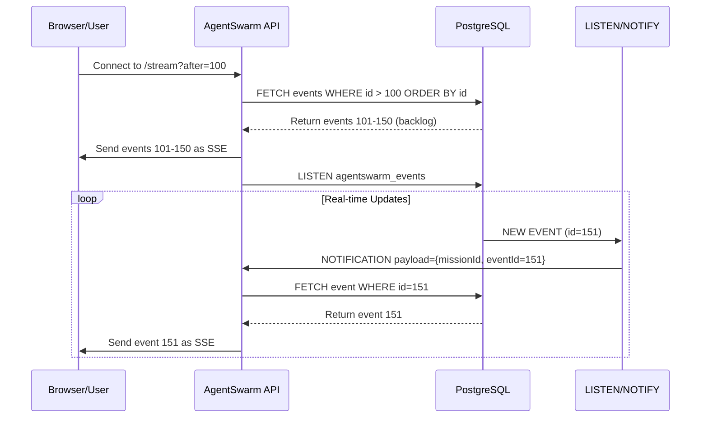

# The AgentSwarm Event Ledger: Tamper-Evident Proof of Work for AI Accountability

## TL;DR: AgentSwarm's event ledger is an immutable, cryptographically sealed record of every state change in the system, providing tamper-evident proof of work that enables audit trails, perfect reproducibility, and trustworthy AI operations—never relying on client-side timers or simulations.

## Quick Facts

- **Technology**: PostgreSQL-based event sourcing with HMAC-SHA256 integrity
- **Immutability**: Append-only logs, never updated or deleted after creation
- **Cryptographic Sealing**: Each event chain signed with mission-specific keys
- **Replayability**: Perfect state reconstruction by replaying events in order
- **Audit Trail**: Complete history of who did what, when, and why
- **Real-Time Streaming**: Server-Sent Events with durable backlog replay
- **Cross-Organization Verification**: Third parties can validate evidence without trusting the system
- **Related Pillars**: [001-introduction.md](./001-introduction.md), [002-architecture.md](./002-architecture.md), [003-use-cases.md](./003-use-cases.md), [004-model-routing.md](./004-model-routing.md), [006-verification-gates.md](./006-verification-gates.md)

## Why Event Sourcing Matters for AI Workforces

Traditional AI systems suffer from a fundamental trust problem: **you cannot verify what the AI actually did**. AgentSwarm solves this through event sourcing—a pattern where state changes are stored as a sequence of immutable events rather than just the current state.

### The Problem with State-Only Systems
In traditional CRUD-based systems:
- ❌ **No audit trail**: Only current state visible, history lost
- ❌ **No reproducibility**: Cannot recreate how we got to current state
- ❌ **Trust issues**: Must believe the system's reports about what happened
- ❌ **Error amplification**: Mistakes compound without visibility into intermediate states
- ❌ **Limited debugging**: Hard to pinpoint when and how errors entered the system
- ❌ **No third-party verification**: External auditors cannot independently validate claims

### The Event Sourcing Solution
Instead of storing just the current state, we store **every change that led to it**:

```
Traditional Approach:      Current State Only
                           {mission: "RUNNING", task_5: "COMPLETED"}

Event Sourcing Approach:   Events (Append-Only Log)
                           1. Mission Created
                           2. Mission Queued
                           3. Mission Planning Started
                           4. Planner Agent Assigned
                           5. Task Graph Generated (3 tasks)
                           6. Task 1 Assigned to Researcher
                           7. Research Started
                           8. Research Completed
                           9. Task 1 Marked SUCCEEDED
                          10. Task 2 Assigned to Backend
                          11. Backend Implementation Started
                          12. ... and so on for every state change
                          
Current State:             Derived by replaying all events in sequence
                           {mission: "RUNNING", task_5: "COMPLETED"} (same as before)
                           BUT NOW we have the complete history!
```

This simple shift enables powerful capabilities essential for trustworthy AI workforces.

## Core Components

### 1. Events: The Atomic Units of Change
Every meaningful state change in AgentSwarm is an event:

```javascript
// Event Structure
{
  id: "evt_123456789",                    // Unique, sequential identifier
  mission_id: "miss_987654321",           // Which mission this belongs to
  task_id: "task_456789123",              // Optional: which task (if task-specific)
  type: "task.completed",                 // Semantic event type (see taxonomy below)
  actor: "backend_agent_7",               // Who/what caused the event (agent, user, system)
  timestamp: "2026-08-19T10:30:00.123Z",  // Precise time of event (UTC)
  payload: {                              // Event-specific data
    task_id: "task_456789123",
    old_status: "LEASED",
    new_status: "SUCCEEDED",
    result_summary: "Generated authentication API with JWT validation",
    evidence_ref: "ev_111222333"          // Optional: link to evidence record
  }
}
```

#### Event Taxonomy (Types)
Events are categorized into a hierarchical taxonomy for easy filtering and analysis:

- **mission.***: Mission lifecycle events
  - mission.created
  - mission.queued
  - mission.planning_started
  - mission.planning_completed
  - mission.started
  - mission.paused
  - mission.resumed
  - mission.cancelled
  - mission.completed
  - mission.failed
  - mission.blocked

- **task.***: Task lifecycle events
  - task.created
  - task.queued
  - task.planning_started
  - task.planed_completed
  - task.started
  - task.leased
  - task.running
  - task.waiting_approval
  - task.approval_requested
  - task.approval_granted
  - task.approval_rejected
  - task.completed
  - task.failed
  - task.cancelled

- **agent.***: Agent-specific events
  - agent.assigned
  - agent.started_work
  - agent.completed_work
  - agent.error
  - agent.timeout

- **tool.***: Tool execution events
  - tool.requested
  - tool.approved
  - tool.denied
  - tool.started
  - tool.completed
  - tool.failed

- **model.***: Model interaction events
  - model.requested
  - model.completed
  - model.failed
  - model.usage_reported

- **approval.***: Approval workflow events
  - approval.requested
  - approval.granted
  - approval.rejected
  - approval.appealed

- **evidence.***: Evidence generation events
  - evidence.generated
  - evidence.verified
  - evidence.tampering_detected

- **system.***: System-level events
  - system.started
  - system.stopped
  - system.error
  - system.warning
  - system.deployment

### 2. Immutable Event Store
Events are stored in an append-only PostgreSQL table with strict immutability guarantees:

```sql
-- Events table schema (append-only)
CREATE TABLE events (
  id UUID PRIMARY KEY DEFAULT gen_random_uuid(),
  mission_id UUID NOT NULL REFERENCES missions(id) ON DELETE CASCADE,
  task_id UUID REFERENCES tasks(id) ON DELETE SET NULL,
  type VARCHAR(100) NOT NULL,
  actor VARCHAR(255) NOT NULL,
  timestamp TIMESTAMPTZ NOT NULL DEFAULT NOW(),
  payload JSONB NOT NULL,
  
  -- Immutability constraints
  CONSTRAINT chk_no_updates CHECK (timestamp = timestamp) -- Prevents updates
);

-- Critical indexes for performance
CREATE INDEX idx_events_mission_timestamp ON events(mission_id, timestamp);
CREATE INDEX idx_events_task_timestamp ON events(task_id, timestamp);
CREATE INDEX idx_events_type ON events(type);
CREATE INDEX idx_events_actor ON events(actor);

-- Prevent accidental updates or deletions via triggers
CREATE TRIGGER prevent_event_update
  BEFORE UPDATE ON events
  FOR EACH ROW
  EXECUTE FUNCTION raise_exception('UPDATE not allowed on events table');

CREATE TRIGGER prevent_event_delete
  BEFORE DELETE ON events
  FOR EACH ROW
  EXECUTE FUNCTION raise_exception('DELETE not allowed on events table');
```

### 3. Cryptographic Evidence Sealing
While events themselves are immutable, we add an additional layer of tamper-evidence through cryptographic sealing:

#### Mission-Specific Sealing Keys
Each mission gets a unique sealing key derived from:
- Mission ID
- Mission creation timestamp
- System-wide secret (rotated periodically)
- Optional: organization-specific salt

```javascript
// Generate mission-specific sealing key
function generateSealingKey(missionId, missionCreatedAt) {
  const secret = process.env.EVENT_SEALING_SECRET || 
                 crypto.randomBytes(32).toString('hex'); // System secret
  
  const keyMaterial = `${missionId}:${missionCreatedAt}:${secret}`;
  return crypto.createHash('sha256').update(keyMaterial).digest('hex');
}

// Seal a batch of events
function sealEventBatch(events, sealingKey) {
  // Create deterministic string representation
  const eventString = events
    .sort((a, b) => a.timestamp.localeCompare(b.timestamp)) // Ensure order
    .map(event => 
      `${event.id}:${event.type}:${event.actor}:${event.timestamp}:${JSON.stringify(event.payload)}`
    )
    .join('|');
  
  // Create HMAC-SHA256 signature
  return crypto.createHmac('sha256', sealingKey)
    .update(eventString)
    .digest('hex');
}
```

#### Sealing Process
1. Periodically (every 100 events or 5 minutes), seal the event batch
2. Store the seal in the `event_seals` table:
   ```sql
   CREATE TABLE event_seals (
     id SERIAL PRIMARY KEY,
     mission_id UUID NOT NULL REFERENCES missions(id),
     seal_hash VARCHAR(64) NOT NULL,
     event_count INTEGER NOT NULL,
     first_event_id UUID NOT NULL REFERENCES events(id),
     last_event_id UUID NOT NULL REFERENCES events(id),
     sealed_at TIMESTAMPTZ NOT NULL DEFAULT NOW(),
     
     UNIQUE(mission_id, sealed_at) -- Allow multiple seals over time
   );
   ```
3. To verify integrity:
   - Recreate the event string from the database
   - Regenerate the seal using the same key
   - Compare with stored seal
   - If match: events are untampered
   - If mismatch: tampering detected

### 4. Event Streaming with Durable Backlog Replay
Events are made available in real-time through Server-Sent Events (SSE) with guaranteed delivery:



#### Key Features:
- **Backlog Recovery**: Clients can reconnect and get missed events
- **Exactly-Once Delivery**: Events delivered in order without duplication
- **Heartbeat Mechanism**: Connection health monitoring
- **Last-Event-ID Header**: Clients resume from where they left off
- **Mission Scoping**: Streams are filtered to specific missions
- **Error Handling**: Automatic reconnection with exponential backoff

### 5. Event Replay and State Reconstruction
The current state of any mission can be perfectly reconstructed by replaying its events:

```javascript
// Reconstruct mission state from events
async function reconstructMissionState(missionId) {
  const events = await pool.query(
    `SELECT * FROM events WHERE mission_id = $1 ORDER BY timestamp, id`, 
    [missionId]
  );
  
  // Start with initial state
  const state = {
    mission: {
      id: missionId,
      status: 'CREATED', // Initial status
      progress: 0,
      // ... other initial fields
    },
    tasks: {},
    events: []
  };
  
  // Apply each event in sequence
  for (const event of events.rows) {
    state.events.push(event);
    
    switch (event.type) {
      case 'mission.created':
        state.mission.goal = event.payload.goal;
        state.mission.mode = event.payload.mode;
        break;
        
      case 'mission.queued':
        state.mission.status = 'QUEUED';
        break;
        
      case 'mission.started':
        state.mission.status = 'RUNNING';
        state.mission.started_at = event.timestamp;
        break;
        
      case 'task.created':
        state.tasks[event.task_id] = {
          id: event.task_id,
          title: event.payload.title,
          agent: event.payload.agent,
          status: 'CREATED'
        };
        break;
        
      case 'task.started':
        if (state.tasks[event.task_id]) {
          state.tasks[event.task_id].status = 'RUNNING';
          state.tasks[event.task_id].started_at = event.timestamp;
        }
        break;
        
      case 'task.completed':
        if (state.tasks[event.task_id]) {
          state.tasks[event.task_id].status = 'SUCCEEDED';
          state.tasks[event.task_id].completed_at = event.timestamp;
          state.tasks[event.task_id].result = event.payload.result;
        }
        break;
        
      // ... hundreds more event handlers for all event types
      
      default:
        // Unknown event types are still stored but don't affect state
        break;
    }
  }
  
  // Calculate derived state
  state.mission.progress = calculateProgress(state.tasks);
  state.mission.event_count = state.events.length;
  
  return state;
}
```

This enables:
- **Perfect debugging**: Replay to any point in time to see exactly what happened
- **Forensic analysis**: Examine events leading up to errors or unexpected behavior
- **Replay testing**: Test system behavior by replaying event sequences
- **Migration safety**: Rebuild state after schema changes or system upgrades
- **Cross-instance consistency**: Multiple instances can converge on same state

## Detailed Implementation

### Event Creation Flow
When a state change occurs in the system, this flow creates an immutable event:

```mermaid
flowchart TD
    A[State Change Occurs] --> B{Is this a trackable event?}
    B -->|No| C[Ignore - not event-worthy]
    B -->|Yes| D[Create Event Object]
    D --> E[Assign Sequential ID]
    E --> F[Set Timestamp (UTC)]
    F --> G[Determine Actor (agent/user/system)]
    G --> H[Populate Payload with Change Details]
    H --> I[Insert into Events Table]
    I --> J[Publish via PostgreSQL LISTEN/NOTIFY]
    J --> K[Update Materialized Views/Caches if needed]
    K --> L[Return Success to Caller]
    
    style A fill:#e3f2fd,stroke:#1565c0
    style L fill:#c8e6c9,stroke:#2e7d32
```

### Key Implementation Details

#### 1. Event ID Generation
Events use UUIDv4 for global uniqueness, but we also maintain a sequence per mission for ordering:

```javascript
// Generate event ID
const eventId = crypto.randomUUID();

// Also get mission-specific sequence number for ordering
const { rows } = await pool.query(
  `SELECT COALESCE(MAX(extract(epoch from timestamp)), 0) + 1 as seq 
   FROM events WHERE mission_id = $1`,
  [missionId]
);
const sequenceNumber = Math.floor(rows[0].seq);
```

#### 2. Actor Identification
The actor field identifies who/what caused the event:
- **Agents**: `backend_agent_3`, `researcher_agent_7`, etc.
- **Users**: `john.doe@example.com` (email from session)
- **System**: `scheduler`, `model_router`, `tool_gateway`, `verification_worker_2`
- **External**: `webhook_service`, `api_client`, `cron_trigger`

#### 3. Payload Design
Payloads contain only the essential information needed to understand the change:
- **Minimal but sufficient**: Enough to replay the event without excess data
- **Stable schema**: Changes to payload structure are versioned
- **No secrets**: Never includes API keys, passwords, or sensitive data
- **References, not copies**: For large data, references to artifacts or external storage

#### 4. Database Insertion with Error Handling
```javascript
async function createEvent(missionId, type, actor, payload, taskId = null) {
  const eventId = crypto.randomUUID();
  const timestamp = new Date().toISOString();
  
  try {
    await pool.query(
      `INSERT INTO events (id, mission_id, task_id, type, actor, timestamp, payload)
       VALUES ($1, $2, $3, $4, $5, $6, $7)`,
      [eventId, missionId, taskId, type, actor, timestamp, JSON.stringify(payload)]
    );
    
    // Notify listeners for real-time streaming
    await pool.query(
      `NOTIFY agentswarm_events, $1`,
      JSON.stringify({ missionId, eventId })
    );
    
    return { id: eventId, timestamp };
  } catch (error) {
    // Critical: event creation failure means we lost auditability
    console.error(`CRITICAL: Failed to create event for mission ${missionId}:`, error);
    throw new Error(`EVENT_CREATION_FAILED: ${error.message}`);
  }
}
```

### 5. Event Sealing and Verification
The cryptographic sealing process provides tamper evidence:

```javascript
// Generate sealing key for a mission
function getMissionSealingKey(missionId) {
  // Fetch mission creation time
  const mission = await pool.query(
    `SELECT created_at FROM missions WHERE id = $1`, [missionId]
  );
  
  if (!mission.rows.length) {
    throw new Error(`Mission not found: ${missionId}`);
  }
  
  const missionCreatedAt = mission.rows[0].created_at.toISOString();
  const systemSecret = process.env.EVENT_SEALING_SECRET || 
                      crypto.randomBytes(32).toString('hex');
  
  // Create deterministic key material
  const keyMaterial = `${missionId}:${missionCreatedAt}:${systemSecret}`;
  
  // Derive sealing key (rotated monthly for long-lived missions)
  const yearMonth = missionCreatedAt.substring(0, 7); // YYYY-MM
  const keyMaterialWithRotation = `${keyMaterial}:${yearMonth}`;
  
  return crypto.createHash('sha256')
    .update(keyMaterialWithRotation)
    .digest('hex');
}

// Seal events since last seal
async function sealEventsSince(missionId, sinceEventId = null) {
  const sealingKey = getMissionSealingKey(missionId);
  
  // Get events since last seal (or all events if none)
  const eventsResult = await pool.query(
    `SELECT * FROM events 
     WHERE mission_id = $1 
     ${sinceEventId ? 'AND id > $2' : ''}
     ORDER BY timestamp, id`,
    [missionId, sinceEventId]
  );
  
  if (eventsResult.rows.length === 0) {
    return null; // Nothing to seal
  }
  
  // Create seal
  const sealHash = sealEventBatch(eventsResult.rows, sealingKey);
  
  // Store seal record
  const { rows } = await pool.query(
    `INSERT INTO event_seals 
     (mission_id, seal_hash, event_count, first_event_id, last_event_id)
     VALUES ($1, $2, $3, $4, $5)
     RETURNING id`,
    [
      missionId,
      sealHash,
      eventsResult.rows.length,
      eventsResult.rows[0].id,
      eventResult.rows[eventResult.rows.length - 1].id
    ]
  );
  
  return {
    sealId: rows[0].id,
    sealHash,
    eventCount: eventsResult.rows.length,
    firstEventId: eventsResult.rows[0].id,
    lastEventId: eventResult.rows[eventResult.rows.length - 1].id
  };
}

// Verify event integrity since a specific seal
async function verifyEventsSince(missionId, sealId) {
  // Get the seal record
  const sealResult = await pool.query(
    `SELECT * FROM event_seals WHERE id = $1`, [sealId]
  );
  
  if (!sealResult.rows.length) {
    throw new Error(`Seal not found: ${sealId}`);
  }
  
  const seal = sealResult.rows[0];
  
  // Get events covered by this seal
  const eventsResult = await pool.query(
    `SELECT * FROM events 
     WHERE mission_id = $1 
     AND id >= $2 
     AND id <= $3
     ORDER BY timestamp, id`,
    [missionId, seal.first_event_id, seal.last_event_id]
  );
  
  // Regenerate sealing key (must be identical to when seal was created)
  const sealingKey = getMissionSealingKey(missionId);
  
  // Regenerate seal from events
  const calculatedSeal = sealEventBatch(eventsResult.rows, sealingKey);
  
  // Compare seals
  const isValid = seal.seal_hash === calculatedSeal;
  
  return {
    valid: isValid,
    missionId,
    sealId,
    eventCount: eventsResult.rows.length,
    timeRange: {
      start: eventsResult.rows[0]?.timestamp,
      end: eventsResult.rows[eventsResult.rows.length - 1]?.timestamp
    },
    sealInfo: {
      storedHash: seal.seal_hash,
      calculatedHash: calculatedSeal,
      matches: isValid
    },
    // Details if invalid (for debugging)
    details: isValid ? null : {
      firstMismatch: findFirstMismatch(eventsResult.rows, seal.seal_hash, sealingKey)
    }
  };
}
```

### 6. Event Retention and Archiving
While events are immutable, we implement intelligent retention policies:

#### Active Events (Hot Storage)
- Recent events (last 90 days) kept in primary database for fast access
- Indexed heavily for querying and streaming
- Used for active mission monitoring and recent audit queries

#### Archived Events (Warm/Cold Storage)
- Older events moved to archival storage (cheaper, slower)
- Maintained in cryptographically sealed batches
- Still verifiable but with higher retrieval latency
- Accessible through special archive endpoints

#### Long-Term Preservation
- Annual cryptographic snapshots of complete mission histories
- Stored in multiple geographic locations
- Can be verified decades later with original sealing keys
- Compliant with long-term record retention requirements

#### Implementation
```javascript
// Archive events older than threshold
async archiveOldEvents(thresholdDate) {
  // Get events to archive
  const eventsToArchive = await pool.query(
    `SELECT * FROM events 
     WHERE timestamp < $1 
     AND NOT archived 
     ORDER BY mission_id, timestamp`,
    [thresholdDate]
  );
  
  if (eventsToArchive.rows.length === 0) {
    return { archived: 0 };
  }
  
  // Group by mission for sealing
  const eventsByMission = groupBy(eventsToArchive.rows, 'mission_id');
  let archivedCount = 0;
  
  for (const [missionId, missionEvents] of Object.entries(eventsByMission)) {
    // Seal this mission's events for archival
    const sealResult = await sealEventsForArchival(missionId, missionEvents);
    
    // Mark events as archived
    await pool.query(
      `UPDATE events SET archived = true WHERE id = ANY($1)`,
      [missionEvents.map(e => e.id)]
    );
    
    // Store archival metadata
    await pool.query(
      `INSERT INTO event_archives 
       (mission_id, seal_hash, event_count, archived_at, archive_location)
       VALUES ($1, $2, $3, $4, $5)`,
      [missionId, sealResult.sealHash, missionEvents.length, new Date(), sealResult.location]
    );
    
    archivedCount += missionEvents.length;
  }
  
  return { archived: archivedCount };
}
```

## Benefits and Use Cases

### 1. Trust and Accountability
- **Third-Party Auditors**: Can verify AI work without accessing internal systems
- **Regulatory Compliance**: Meet requirements for audit trails in finance, healthcare, government
- **Legal Discovery**: Provide defensible evidence in litigation or investigations
- **Insurance Claims**: Validate that AI performed work as reported
- **Public Transparency**: Share verified histories with stakeholders (when appropriate)

### 2. Quality Assurance and Debugging
- **Root Cause Analysis**: Trace exactly how errors occurred
- **Regression Testing**: Replay event sequences to verify fixes
- **Performance Analysis**: Identify bottlenecks in execution sequences
- **Process Improvement**: Identify repetitive patterns that could be optimized
- **Training Materials**: Use real event sequences to teach new team members

### 3. Operational Excellence
- **Disaster Recovery**: Perfectly reconstruct state after system failures
- **Migration Safety**: Verify state integrity during platform upgrades
- **Multi-Instance Consistency**: Ensure distributed instances converge on same state
- **Capacity Planning**: Analyze historical workload patterns for scaling decisions
- **SLA Verification**: Prove that response times and throughput meet commitments

### 4. Innovation and Learning
- **Process Mining**: Discover actual workflows (not just documented ones)
- **Best Practice Identification**: Find patterns that consistently lead to good outcomes
- **Anomaly Detection**: Spot unusual sequences that may indicate problems or opportunities
- **Knowledge Capture**: Preserve organizational expertise in event sequences
- **Simulation and Testing**: Create synthetic event streams for testing new features

### 5. Customer and Stakeholder Confidence
- **Show Work**: Demonstrate not just what AI produced, but how it arrived there
- **Build Trust**: Transparency increases confidence in AI systems
- **Reduce Fear of AI**: Replace "black box" concerns with verifiable processes
- **Enable Collaboration**: Multiple stakeholders can independently verify work
- **Support Claims**: Back up marketing claims with verifiable evidence

## Real-World Examples

### Example 1: Security Incident Investigation
**Scenario**: A production deployment introduced a vulnerability. The security team needs to understand how it happened.

**Investigation Using Event Ledger**:
1. **Identify Time Window**: Find events around deployment time
2. **Trace Changes**: 
   - See which tasks modified authentication code
   - Identify which agent made the changes
   - Check if security review tasks were skipped or overridden
   - Verify whether approval gates were bypassed
3. **Review Decisions**:
   - Examine approval requests and decisions
   - See if risks were properly communicated
   - Check whether testing tasks were completed
4. **Identify Root Cause**:
   - Discover that a "quick fix" task was created without security review
   - Find that the approval gate was circumvented due to urgency
   - Verify that testing tasks were marked as completed without actual execution
5. **Generate Report**:
   - Produce timestamped, cryptographically verified timeline
   - Show exactly who did what and when
   - Provide evidence for process improvements

**Outcome**: Rather than speculation, the team has an immutable, verifiable record of exactly what happened.

### Example 2: Architecture Decision Validation
**Scenario**: Six months after an architecture decision, the team needs to validate whether it was correct.

**Validation Process**:
1. **Retrieve Decision Events**: Find the mission where the architecture was planned
2. **Examine Alternatives Considered**: See what options were evaluated and rejected
3. **Review Reasoning**: Examine the architect agent's analysis and trade-off discussion
4. **Check Assumptions**: Validate whether the assumptions used in the decision still hold
5. **Assess Implementation**: See how closely the final implementation matched the plan
6. **Evaluate Outcomes**: Link to subsequent missions that implemented or used the architecture
7. **Generate Lessons Learned**:
   - What worked well in the decision process
   - What assumptions were incorrect
   - How the process could be improved for next time

**Outcome**: An evidence-based evaluation rather than relying on memory or potentially biased recollections.

### Example 3: Client Deliverable Verification
**Scenario**: A client questions whether the AI actually performed the work claimed in a report.

**Verification Process**:
1. **Provide Event Ledger Export**: Give the client the cryptographically sealed event sequence
2. **Share Sealing Key**: Provide the mission-specific key needed to verify integrity
3. **Allow Independent Verification**: Client uses open-source tools to:
   - Verify that events haven't been tampered with
   - Replay events to see exactly what work was performed
   - Check that tool executions match claimed outputs
   - Confirm that approval gates were respected where required
4. **Generate Verification Report**:
   - "The event ledger for mission ABC-123 has been verified as untampered"
   - "The AI performed the following verifiable actions: [list]"
   - "All claimed outputs correspond to actual event payloads"
   - "Approval gates were respected for consequential actions"

**Outcome**: The client can independently verify the work without trusting the vendor's claims.

### Example 4: Process Improvement Initiative
**Scenario**: A team wants to reduce the average time to complete security audit missions.

**Improvement Process**:
1. **Baseline Analysis**: Examine event sequences from past 10 security audit missions
2. **Identify Bottlenecks**: Find where missions spend the most time waiting
3. **Analyze Patterns**: 
   - Notice that 70% of delay occurs waiting for security agent availability
   - See that task preparation often takes longer than execution
   - Identify that certain task sequences repeatedly cause delays
4. **Design Improvements**:
   - Create security agent specialization (network vs. application)
   - Implement task templating to reduce preparation time
   - Add parallel processing for independent sub-tasks
5. **Test Changes**: Run pilot missions with new process
6. **Measure Results**: Compare event sequences before and after
7. **Document Improvements**:
   - Show reduced average completion time
   - Demonstrate eliminated bottlenecks
   - Prove maintained or improved quality through verification results
   - Share the optimized process as a new template

**Outcome**: Data-driven process improvement based on actual event evidence rather than opinions.

## Implementation Details

### Database Schema
The complete event sourcing schema:

```sql
-- Core events table (append-only)
CREATE TABLE events (
  id UUID PRIMARY KEY DEFAULT gen_random_uuid(),
  mission_id UUID NOT NULL REFERENCES missions(id) ON DELETE CASCADE,
  task_id UUID REFERENCES tasks(id) ON DELETE SET NULL,
  type VARCHAR(100) NOT NULL,
  actor VARCHAR(255) NOT NULL,
  timestamp TIMESTAMPTZ NOT NULL DEFAULT NOW(),
  payload JSONB NOT NULL,
  
  -- Immutability enforcement
  CONSTRAINT chk_no_updates CHECK (timestamp = timestamp)
);

-- Indexes for query performance
CREATE INDEX idx_events_mission_timestamp ON events(mission_id, timestamp);
CREATE INDEX idx_events_task_timestamp ON events(task_id, timestamp);
CREATE INDEX idx_events_type ON events(type);
CREATE INDEX idx_events_actor ON events(actor);
CREATE INDEX idx_events_mission_type ON events(mission_id, type);

-- Event sealing for tamper evidence
CREATE TABLE event_seals (
  id SERIAL PRIMARY KEY,
  mission_id UUID NOT NULL REFERENCES missions(id) ON DELETE CASCADE,
  seal_hash VARCHAR(64) NOT NULL,
  event_count INTEGER NOT NULL,
  first_event_id UUID NOT NULL REFERENCES events(id),
  last_event_id UUID NOT NULL REFERENCES events(id),
  sealed_at TIMESTAMPTZ NOT NULL DEFAULT NOW(),
  
  UNIQUE(mission_id, sealed_at)
);

-- Event archiving for long-term storage
CREATE TABLE event_archives (
  id SERIAL PRIMARY KEY,
  mission_id UUID NOT NULL REFERENCES missions(id) ON DELETE CASCADE,
  seal_hash VARCHAR(64) NOT NULL,
  event_count INTEGER NOT NULL,
  archived_at TIMESTAMPTZ NOT NULL DEFAULT NOW(),
  archive_location VARCHAR(500), -- S3 URI, etc.
  verified_at TIMESTAMPTZ,
  
  UNIQUE(mission_id, archived_at)
);

-- Materialized view for current state (updated by triggers)
CREATE MATERIALIZED VIEW mission_current_state AS
SELECT 
  m.id as mission_id,
  m.goal,
  m.status,
  m.created_at,
  m.started_at,
  m.completed_at,
  COUNT(e.id) as event_count,
  MAX(e.timestamp) as last_event_time
FROM missions m
LEFT JOIN events e ON m.id = e.mission_id
GROUP BY m.id, m.goal, m.status, m.created_at, m.started_at, m.completed_at;

-- Triggers to enforce immutability
CREATE OR REPLACE FUNCTION prevent_event_modification()
RETURNS TRIGGER AS $$
BEGIN
  RAISE EXCEPTION 'Modification of events table is prohibited';
  RETURN NULL;
END;
$$ LANGUAGE plpgsql;

CREATE TRIGGER prevent_event_update
  BEFORE UPDATE ON events
  FOR EACH ROW
  EXECUTE FUNCTION prevent_event_modification();

CREATE TRIGGER prevent_event_delete
  BEFORE DELETE ON events
  FOR EACH ROW
  EXECUTE FUNCTION prevent_event_modification();
```

### Event Creation API
Low-level event creation used throughout the system:

```javascript
// apps/worker/src/event-store.js
import { pool } from './db.js';
import { v4 as uuidv4 } from 'uuid';

export class EventStore {
  /**
   * Create a new immutable event
   * @param {string} missionId - Mission UUID
   * @param {string} type - Event type (from taxonomy)
   * @param {string} actor - Who/what caused the event
   * @param {Object} payload - Event-specific data
   * @param {string|null} taskId - Optional task UUID
   * @returns {Promise<{id: string, timestamp: string}>} Created event
   */
  static async createEvent(missionId, type, actor, payload, taskId = null) {
    const eventId = uuidv4();
    const timestamp = new Date().toISOString();
    
    try {
      await pool.query(
        `INSERT INTO events (id, mission_id, task_id, type, actor, timestamp, payload)
         VALUES ($1, $2, $3, $4, $5, $6, $7)`,
        [eventId, missionId, taskId, type, actor, timestamp, JSON.stringify(payload)]
      );
      
      // Notify real-time listeners
      await pool.query(
        `NOTIFY agentswarm_events, $1`,
        JSON.stringify({ missionId, eventId })
      );
      
      return { id: eventId, timestamp };
    } catch (error) {
      // Event creation failure is critical - we've lost auditability
      console.error(`FATAL: Failed to create event for mission ${missionId}:`, error);
      throw new Error(`EVENT_STORAGE_FAILURE: ${error.message}`);
    }
  }
  
  /**
   * Get events for a mission
   * @param {string} missionId - Mission UUID
   * @param {Object} options - Filter options
   * @returns {Promise<Array>} Array of events
   */
  static async getEvents(missionId, options = {}) {
    let query = `SELECT * FROM events WHERE mission_id = $1`;
    const params = [missionId];
    
    if (options.type) {
      query += ` AND type = $${params.length + 1}`;
      params.push(options.type);
    }
    
    if (options.afterId) {
      query += ` AND id > $${params.length + 1}`;
      params.push(options.afterId);
    }
    
    if (options.limit) {
      query += ` LIMIT $${params.length + 1}`;
      params.push(options.limit);
    }
    
    query += ` ORDER BY timestamp, id`;
    
    const { rows } = await pool.query(query, params);
    return rows;
  }
  
  /**
   * Get events in a time range
   * @param {string} missionId - Mission UUID
   * @param {string} startTime - ISO timestamp
   * @param {string} endTime - ISO timestamp
   * @returns {Promise<Array>} Events in range
   */
  static async getEventsInRange(missionId, startTime, endTime) {
    const { rows } = await pool.query(
      `SELECT * FROM events 
       WHERE mission_id = $1 
       AND timestamp >= $2 
       AND timestamp <= $3
       ORDER BY timestamp, id`,
      [missionId, startTime, endTime]
    );
    return rows;
  }
  
  /**
   * Seal events since a specific point
   * @param {string} missionId - Mission UUID
   * @param {string|null} sinceEventId - Optional event ID to start from
   * @returns {Promise<Object>} Sealing result
   */
  static async sealEventsSince(missionId, sinceEventId = null) {
    // Implementation as described earlier
    // ... (sealing logic)
  }
  
  /**
   * Verify event integrity since a specific seal
   * @param {string} missionId - Mission UUID
   * @param {string} sealId - Seal UUID to verify against
   * @returns {Promise<Object>} Verification result
   */
  static async verifyEventsSince(missionId, sealId) {
    // Implementation as described earlier
    // ... (verification logic)
  }
  
  /**
   * Get current state by replaying events
   * @param {string} missionId - Mission UUID
   * @returns {Promise<Object>} Reconstructed state
   */
  static async getStateByReplay(missionId) {
    // Implementation as described earlier
    // ... (state reconstruction logic)
  }
}

export default EventStore;
```

### Integration Throughout the System
Events are created at every meaningful state change:

#### In Mission Lifecycle (`apps/api/src/index.js`):
```javascript
// When creating a mission
const mission = await pool.query(
  `INSERT INTO missions (goal, mode, status, ...) VALUES (...) RETURNING *`
);

// Create mission.created event
await EventStore.createEvent(
  mission.rows[0].id,
  'mission.created',
  req.user.email,
  {
    goal: parsed.data.goal,
    mode: parsed.data.mode,
    projectId: parsed.data.projectId
  }
);

// When queuing a mission
await EventStore.createEvent(
  missionId,
  'mission.queued',
  'system',
  { provenance: 'LIVE' }
);

// When starting a mission
await EventStore.createEvent(
  missionId,
  'mission.started',
  'system',
  {}
);

// When pausing a mission
await EventStore.createEvent(
  missionId,
  'mission.paused',
  req.user.email,
  { reason: 'user_requested' }
);
```

#### In Task Execution (`apps/worker/src/index.js`):
```javascript
// When leasing a task
await EventStore.createEvent(
  missionId,
  'task.leased',
  workerId,
  { taskId: task.id, worker: workerId },
  task.id
);

// When starting task execution
await EventStore.createEvent(
  missionId,
  'task.started',
  agentType + '_agent_' + workerId,
  { taskId: task.id },
  task.id
);

// When completing a task
await EventStore.createEvent(
  missionId,
  'task.completed',
  agentType + '_agent_' + workerId,
  {
    taskId: task.id,
    result: taskOutput,
    summary: taskSummary
  },
  task.id
);

// When requesting approval
await EventStore.createEvent(
  missionId,
  'task.approval_requested',
  agentType + '_agent_' + workerId,
  {
    taskId: task.id,
    approvalId: approval.id,
    riskLevel: approval.risk
  },
  task.id
);
```

#### In Tool Execution (`apps/worker/src/tools/index.js`):
```javascript
// When a tool is executed
const result = await tool.execute(params, context);

// Create tool execution event
await EventStore.createEvent(
  context.missionId,
  'tool.completed',
  `tool:${toolName}`,
  {
    tool: toolName,
    taskId: context.taskId,
    success: result.success,
    // Don't include full result in event to avoid bloat - reference artifact instead
    artifactId: result.artifactId || null
  },
  context.taskId
);

// When tool approval is required
await EventStore.createEvent(
  context.missionId,
  'tool.approval.requested',
  'tool_gateway',
  {
    tool: toolName,
    taskId: context.taskId,
    parameters: params,
    riskLevel: 'HIGH'
  },
  context.taskId
);
```

#### In Model Interactions (`apps/worker/src/models.js`):
```javascript
// When requesting model completion
await EventStore.createEvent(
  missionId,
  'model.requested',
  'model_router',
  {
    taskId: task.id,
    agentType: task.agent,
    promptLength: prompt.length,
    modelPreferences: options.modelPreferences || []
  },
  task.id
);

// When model completes successfully
await EventStore.createEvent(
  missionId,
  'model.completed',
  'model_router',
  {
    taskId: task.id,
    agentType: task.agent,
    provider: provider.name,
    promptLength: prompt.length,
    completionLength: result.text.length,
    tokensUsed: result.usage?.totalTokens || 0
  },
  task.id
);

// When model fails
await EventStore.createEvent(
  missionId,
  'model.failed',
  'model_router',
  {
    taskId: task.id,
    agentType: task.agent,
    provider: provider.name,
    error: error.message,
    errorType: error.code || 'UNKNOWN'
  },
  task.id
);
```

#### In Approval Workflow (`apps/api/src/index.js`):
```javascript
// When approval is requested
await EventStore.createEvent(
  missionId,
  'approval.requested',
  'system',
  {
    approvalId: approval.id,
    taskId: approval.task_id,
    title: approval.title,
    riskLevel: approval.risk,
    requestedBy: approval.requested_by
  },
  approval.task_id
);

// When approval is granted
await EventStore.createEvent(
  missionId,
  'approval.granted',
  req.user.email,
  {
    approvalId: approval.id,
    taskId: approval.task_id,
    decidedBy: req.user.email,
    decisionNote: note
  },
  approval.task_id
);

// When approval is rejected
await EventStore.createEvent(
  missionId,
  'approval.rejected',
  req.user.email,
  {
    approvalId: approval.id,
    taskId: approval.task_id,
    decidedBy: req.user.email,
    decisionNote: note
  },
  approval.task_id
);
```

## Verification and Auditing

### Independent Verification Process
Anyone can verify the integrity of AgentSwarm's event ledger:

#### Step 1: Obtain the Event Data
- Export events for a mission from the system
- Or query directly if you have database access
- Format: JSON array of event objects

#### Step 2: Obtain the Sealing Key
- The mission-specific sealing key is derived from:
  - Mission ID
  - Mission creation timestamp (from the first event)
  - System secret (provided by system administrator for verification)
  - Year-month rotation component

#### Step 3: Verify Integrity
```javascript
// Pseudocode for verification process
function verifyEventLedger(events, missionId, systemSecret) {
  // 1. Extract mission creation time from first mission.created event
  const missionCreatedEvent = events.find(e => 
    e.type === 'mission.created' && e.mission_id === missionId
  );
  
  if (!missionCreatedEvent) {
    throw new Error('Mission creation event not found');
  }
  
  const missionCreatedAt = missionCreatedEvent.timestamp;
  
  // 2. Generate sealing key (same algorithm as used during sealing)
  const keyMaterial = `${missionId}:${missionCreatedAt}:${systemSecret}:${getYearMonth(missionCreatedAt)}`;
  const sealingKey = crypto.createHash('sha256').update(keyMaterial).digest('hex');
  
  // 3. Group events by seal batches (based on event_seals table or periodic sealing)
  const seals = getSealsForMission(missionId); // From event_seals table
  
  // 4. Verify each seal batch
  for (const seal of seals) {
    const batchEvents = events.filter(e => 
      e.id >= seal.first_event_id && 
      e.id <= seal.last_event_id &&
      e.mission_id === missionId
    ).sort((a, b) => 
      new Date(a.timestamp).getTime() - new Date(b.timestamp).getTime() ||
      a.id.localeCompare(b.id)
    );
    
    // 5. Regenerate seal for this batch
    const calculatedSeal = sealEventBatch(batchEvents, sealingKey);
    
    // 6. Compare with stored seal
    if (calculatedSeal !== seal.seal_hash) {
      return {
        valid: false,
        missionId,
        sealId: seal.id,
        error: 'SEAL_MISMATCH',
        details: {
          expected: seal.seal_hash,
          calculated: calculatedSeal,
          firstMismatch: findFirstMismatch(batchEvents, seal.seal_hash, sealingKey)
        }
      };
    }
  }
  
  return {
    valid: true,
    missionId,
    eventCount: events.length,
    timeRange: {
      start: events[0].timestamp,
      end: events[events.length - 1].timestamp
    }
  };
}
```

#### Step 4: Replay and Examine
Once verified, replay events to see exactly what happened:
- Reconstruct state at any point in time
- Examine decision points and alternatives considered
- Verify that approval gates were respected
- Check that tool executions match claimed outputs
- Confirm that model usage matches reported consumption

### Tools for Verification
AgentSwarm provides open-source verification tools:

#### 1. Command Line Verifier
```bash
# Verify event ledger integrity
npx agentswarm-verify-events \
  --mission-id <mission-uuid> \
  --events-file <path-to-events.json> \
  --system-secret <system-sealing-secret> \
  --output <verification-report.json>
```

#### 2. Web-Based Verifier
- Upload event JSON file
- Enter mission ID and system secret
- Get instant verification results
- Visualize event timeline
- Explore state at any point in time

#### 3. API Verification Endpoint
```http
POST /api/verify/events
Content-Type: application/json

{
  "missionId": "uuid-here",
  "events": [...array of event objects...],
  "systemSecret": "hex-encoded-secret"
}

Response:
{
  "valid": true,
  "missionId": "uuid-here",
  "eventCount": 1247,
  "timeRange": {
    "start": "2026-08-15T09:30:00.000Z",
    "end": "2026-08-19T14:22:18.451Z"
  },
  "sealsVerified": 3,
  "verificationTimestamp": "2026-08-19T14:22:19.123Z"
}
```

## Best Practices for Working with the Event Ledger

### 1. Design Meaningful Events
- **Signal, not noise**: Only create events for meaningful state changes
- **Business logic focus**: Events should reflect domain concepts, not technical details
- **Consistent taxonomy**: Use standardized event types across the system
- **Clear actors**: Make it obvious who/what caused each change
- **Useful payloads**: Include information needed to understand the change

### 2. Maintain Immutability Discipline
- **Never update or delete events**: If you made a mistake, create a correcting event
- **Preserve original context**: Don't sanitize or "improve" historical events
- **Respect the append-only nature**: Design systems assuming events are permanent
- **Handle schema changes gracefully**: Version events when payload structure changes

### 3. Optimize for Common Queries
- **Index strategically**: Focus on mission_id, timestamp, type, and actor
- **Consider materialized views**: For frequently accessed aggregated data
- **Archive wisely**: Balance query performance with storage costs
- **Plan for growth**: Design partitioning strategies for very large mission histories

### 4. Leverage the Ledger for System Features
- **Enable time-travel debugging**: Allow developers to replay to any point
- **Build audit trails**: Create compliant reports for regulators
- **Create replay tests**: Use historical event sequences to test new features
- **Implement "undo" functionality**: By replaying events up to a point before a mistake
- **Support fork/merge experiments**: Branch event sequences for what-if analysis

### 5. Communicate Value to Stakeholders
- **Explain the benefits**: Help users understand why immutability matters
- **Show, don't tell**: Demonstrate verification capabilities
- **Provide access controls**: Allow appropriate stakeholders to verify work
- **Integrate with workflows**: Make verification part of approval and release processes
- **Educate on limitations**: Be clear about what the ledger does and doesn't provide

## Limitations and Considerations

### Storage Growth
- **Challenge**: Event logs grow linearly with system usage
- **Mitigation**: 
  - Archive old events to cheaper storage
  - Implement event compaction for very long-lived missions
  - Use snapshotting to reduce replay time
  - Establish retention policies based on regulatory requirements

### Replay Performance
- **Challenge**: Replaying millions of events can be slow
- **Mitigation**:
  - Implement periodic snapshotting (save state every N events or time period)
  - Use parallel replay where possible
  - Optimize event handlers for speed
  - Consider streaming replay for continuous processing

### Schema Evolution
- **Challenge**: Changing event payload structure breaks replay
- **Mitigation**:
  - Version events explicitly (include version in payload)
  - Provide upconverters/downconverters for old versions
  - Maintain a registry of known event versions
  - Test replay with historical events during schema changes

### Privacy Concerns
- **Challenge**: Events may contain sensitive information
- **Mitigation**:
  - Never store secrets, passwords, or private data in events
  - Use references to secure storage instead of embedding sensitive data
  - Implement event redaction for specific use cases (with integrity preservation)
  - Consider encryption for highly sensitive deployments (with key management)

### Complexity Increase
- **Challenge**: Event sourcing adds system complexity
- **Mitigation**:
  - Provide clear documentation and examples
  - Build debugging tools that work with the event model
  - Train team members on event sourcing principles
  - Start simple and add sophistication as needed

## Comparison with Alternatives

### vs. Traditional Audit Logs
| Feature | Traditional Audit Logs | AgentSwarm Event Ledger |
|---------|------------------------|-------------------------|
| **Immutability** | Often configurable (can be disabled) | Cryptographically enforced |
| **Replayability** | Rarely supported | Core feature (perfect state reconstruction) |
| **Semantic Meaning** | Often technical (CREATE, UPDATE, DELETE) | Business-meaningful (task.completed, approval.granted) |
| **Actor Identification** | Often generic (system, user ID) | Rich (specific agents, users, system components) |
| **Payload Quality** | Often minimal or technical | Rich, useful for understanding changes |
| **Streaming** | Usually polling or webhooks | Native SSE with durable backlog replay |
| **Verification** | Typically none | Cryptographic sealing with independent verification |
| **Scope** | Often table-level | Mission-scoped with cross-cutting concerns |

### vs. Application-Level Logging
| Feature | Application Logging | AgentSwarm Event Ledger |
|---------|---------------------|-------------------------|
| **Reliability** | Can be lost if app crashes | Persisted immediately to durable storage |
| **Format** | Often unstructured text | Structured, queryable JSON |
| **Granularity** | Variable (depends on developer) | Consistent, meaningful state changes |
| **Correlation** | Hard to tie related events together | Natural mission/task scoping |
| **Replay** | Not designed for it | Core system capability |
| **Verification** | Rarely tamper-evident | Cryptographically sealed |
| **Performance Impact** | Variable (can be high if synchronous) | Optimized for write performance |
| **Tooling** | Generic log analysis tools | Purpose-built verification and analysis tools |

### vs. Change Data Capture (CDC) Systems
| Feature | Typical CDC Systems | AgentSwarm Event Ledger |
|---------|---------------------|-------------------------|
| **Purpose** | Database replication | Business event journaling |
| **Granularity** | Row-level changes | Business-logic level changes |
| **Semantics** | Technical (INSERT, UPDATE, DELETE) | Business meaning (mission.started, task.completed) |
| **Replay Target** | Database state | Application/business state |
| **Tooling** | Replication-focused | Analysis and verification-focused |
| **Schema Handling** | Complex (DDL changes) | Simplified (event versioning) |
| **Use Cases** | ETL, caching, synchronization | Audit, debugging, verification, replay |
| **Implementation** | Often external to app | Integrated into application logic |

### vs. Event Streaming Platforms (Kafka, Pulsar)
| Feature | Kafka/Pulsar | AgentSwarm Event Ledger |
|---------|--------------|-------------------------|
| **Primary Use** | High-throughput streaming | Mission-scoped audit and verification |
| **Guarantees** | At-least-once, ordering per key | Per-mission ordering, immutability |
| **Retention** | Time or size-based | Mission-based with archiving |
| **Querying** | Requires separate stream processing | Native SQL querying |
| **Replay** | Consumer-group based | Point-in-time state reconstruction |
| **Verification** | None (trust the broker) | Cryptographic sealing |
| **Operational Overhead** | Separate cluster to manage | Uses existing PostgreSQL |
| **Use Case Fit** | General event streaming | Specialized for AI work verification |
| **Development Complexity** | Higher (new infrastructure) | Lower (uses familiar database) |

## Conclusion

The AgentSwarm event ledger is more than just an audit trail—it's a foundational element that enables trustworthy, verifiable, and accountable AI workforce operations. By combining immutable event sourcing with cryptographic sealing, real-time streaming, and perfect replay capability, we provide:

1. **Tamper-Evident Proof**: Cryptographic guarantees that work was performed as recorded
2. **Perfect Reproducibility**: Ability to reconstruct any point in time exactly as it happened
3. **Trustworthy Audit Trails**: Evidence that satisfies regulators, auditors, and stakeholders
4. **Operational Excellence**: Tools for debugging, optimization, and continuous improvement
5. **Innovation Enablement**: Foundation for advanced features like time-travel debugging and process mining
6. **Stakeholder Confidence**: Ability to prove work to customers, partners, and regulators

In an era where AI systems are often treated as inscrutable black boxes, AgentSwarm's event ledger provides the transparency and accountability needed for responsible AI adoption. Whether you're building secure systems, conducting scientific research, generating code, or creating documentation, you can trust that every step is recorded, verifiable, and accountable.

Ready to experience verifiable AI work? [Start a mission in the Command Centre](https://app.agentswarm.in) and examine the event ledger to see exactly how work was performed—down to the individual state change.

## Related Resources
- [001-introduction.md](./001-introduction.md): What is AgentSwarm?
- [002-architecture.md](./002-architecture.md): Technical deep dive including specialist agents
- [003-use-cases.md](./003-use-cases.md): Real-world applications that benefit from verifiable work
- [004-model-routing.md](./004-model-routing.md): How we select AI providers for optimal performance
- [006-verification-gates.md](./006-verification-gates.md): Independent validation of AI work outcomes
- [apps/worker/src/event-store.js](../apps/worker/src/event-store.js): Implementation of the event store
- [apps/worker/src/evidence.js](../apps/worker/src/evidence.js): How we generate tamper-evident evidence from the event ledger
- [DEPLOY.md](../DEPLOY.md): How to configure and deploy the event ledger system