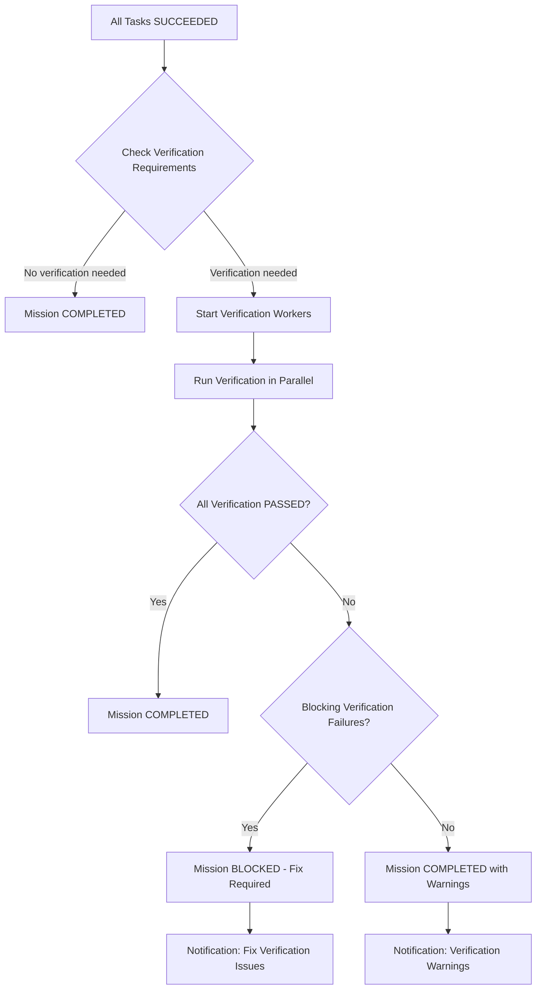

# Verification Gates in AgentSwarm: Independent Validation of AI Work Outcomes

## TL;DR: AgentSwarm employs eight specialized verification workers (build, test, type, security, browser, accessibility, performance, acceptance) that independently validate AI-generated outputs—going far beyond simple artifact counting to ensure quality, correctness, and trustworthiness.

## Quick Facts

- **Verification Types**: Build, Test, Type Checking, Security, Browser, Accessibility, Performance, Acceptance
- **Independence**: Workers operate separately from execution agents with different criteria
- **Standards-Based**: Uses industry-standard tools (ESLint, Jest, OWASP, axe-core, Lighthouse, etc.)
- **Configurable Policies**: Thresholds, rules, and requirements customizable per mission/organization
- **Evidence Integration**: Results feed into tamper-evident evidence ledger for audit trails
- **Blocking Gates**: Can prevent mission completion until verification passes
- **Related Pillars**: [001-introduction.md](./001-introduction.md), [002-architecture.md](./002-architecture.md), [003-use-cases.md](./003-use-cases.md), [004-model-routing.md](./004-model-routing.md), [005-event-ledger.md](./005-event-ledger.md)

## Why Verification Gates Matter

Traditional AI systems often rely on flawed quality signals:
- ❌ **Artifact Counting**: "We generated 5 files, so the work must be good"
- ❌ **Self-Assessment**: "The AI says it completed the task successfully"
- ❌ **Output Existence**: "We have output files, so validation passes"
- ❌ **Human Spot-Checking**: Inconsistent, subjective, and doesn't scale

These approaches fail to catch critical issues like:
- Security vulnerabilities in generated code
- Type mismatches that cause runtime failures
- Accessibility violations that exclude users
- Performance bottlenecks that degrade user experience
- Functional incorrectness that leads to wrong business decisions
- Build failures that prevent deployment
- Browser incompatibilities that break user experience

AgentSwarm's verification gates solve these problems through **independent, standards-based validation** that operates separately from the AI generation process.

## The Verification Architecture

AgentSwarm implements a layered verification approach:

```
┌─────────────────────────────────────┐
│     Mission Execution Layer         │
│  (Planner → Specialist Agents →     │
│   Tool Usage → Artifact Generation) │
└────────────────────┬────────────────┘
                     │
                     ▼
┌─────────────────────────────────────┐
│    Verification Coordination Layer  │
│  (Determines what needs verification│
│   based on task types and policies) │
└────────────────────┬────────────────┘
                     │
                     ▼
┌─────────────────────────────────────┐
│    Independent Verification Workers │
│  ┌──────────────┐ ┌──────────────┐  │
│  │  Build       │ │  Test        │  │
│  │  Worker      │ │  Worker      │  │
│  ├──────────────┤ ├──────────────┤  │
│  │  Type        │ │  Security    │  │
│  │  Checker     │ │  Worker      │  │
│  ├──────────────┤ ├──────────────┤  │
│  │  Browser     │ │  Accessibility│ │
│  │  Worker      │ │  Worker      │  │
│  ├──────────────┤ ├──────────────┤  │
│  │  Performance │ │  Acceptance  │  │
│  │  Worker      │ │  Worker      │  │
│  └──────────────┘ └──────────────┘  │
└────────────────────┬────────────────┘
                     │
                     ▼
┌─────────────────────────────────────┐
│     Evidence & Feedback Layer       │
│  (Results stored in evidence ledger,│
│   feedback to mission coordination) │
└─────────────────────────────────────┘
```

### Key Principles

1. **Independence**: Verification workers operate separately from execution agents, often using different tools, models, or even different AI providers.

2. **Standards-Based**: Uses established industry standards and tools rather than ad-hoc AI-generated validation.

3. **Configurable**: Organizations can define what verification is required for different task types and risk levels.

4. **Evidence-Integrated**: Verification results are stored in the tamper-evident evidence ledger for audit trails.

5. **Feedback-Driven**: Results inform future missions through policy adjustment and template improvement.

6. **Blocking Capability**: Critical verification failures can prevent mission completion until resolved.

## The Eight Verification Workers

### 1. Build Verification Worker
**Purpose**: Ensures generated code or artifacts can be successfully built/compiled.

**What It Validates**:
- Code compiles without errors
- Dependencies resolve correctly
- Build scripts execute successfully
- Generated artifacts are in expected format
- No missing files or references

**Tools & Techniques**:
- Language-specific compilers (gcc, javac, tsc, etc.)
- Build systems (Make, Maven, Gradle, Webpack, etc.)
- Dependency checkers (npm audit, pip check, etc.)
- Format validators (JSON schema, XML validation, etc.)
- Custom build scripts provided in task context

**Example Validations**:
- TypeScript code compiles to JavaScript without errors
- Dockerfile builds successfully
- CloudFormation template validates
- SQL schema creates tables without errors
- Makefile executes all targets successfully

**Failure Examples**:
- Missing semicolons in TypeScript
- Unresolved npm dependencies
- Docker build fails due to missing base image
- CloudFormation template has syntax errors
- Java class doesn't compile due to missing imports

### 2. Test Verification Worker
**Purpose**: Ensures generated code includes valid tests that pass.

**What It Validates**:
- Unit tests exist and execute
- Test assertions are meaningful (not just `expect(true).toBe(true)`)
- Test coverage meets minimum thresholds
- Tests fail appropriately when code is broken
- Integration tests validate component interactions

**Tools & Techniques**:
- Test runners (Jest, Mocha, Pytest, JUnit, etc.)
- Coverage analyzers (Istambul, JaCoCo, coverage.py, etc.)
- Test quality analyzers (mutation testing, test smell detection)
- Custom test frameworks provided in task context
- Property-based testing tools (when applicable)

**Example Validations**:
- Jest test suite runs with ≥80% line coverage
- Pytest discovers and runs test functions
- JUnit tests pass with meaningful assertions
- Property-based tests generate valid counterexamples
- Custom test framework executes successfully

**Failure Examples**:
- Test files exist but contain no actual tests
- All tests are trivial (`expect(1+1).toBe(2)`)
- Coverage falls below configured threshold (e.g., <60%)
- Tests pass even when corresponding implementation is broken
- Test dependencies are missing or unresolved

### 3. Type Checking Verification Worker
**Purpose**: Ensures generated code adheres to type systems and contracts.

**What It Validates**:
- Static type analysis passes without errors
- Type definitions are correct and complete
- Function signatures match usage
- Type imports/resolutions work correctly
- No implicit `any` types (when disallowed)
- Generic types used correctly

**Tools & Techniques**:
- Type checkers (tsc, mypy, flow, etc.)
- Linters with type-checking rules (ESLint + @typescript-eslint)
- Type coverage analyzers
- Contract testing frameworks (when applicable)
- Schema validation tools (JSON Schema, OpenAPI validators)

**Example Validations**:
- TypeScript code passes `tsc --noEmit` with no errors
- Python code passes mypy strict mode checks
- Flow typechecker finds no issues in JavaScript code
- OpenAPI schema validates against sample requests/responses
- JSON Schema validates generated configuration files

**Failure Examples**:
- TypeScript reports "Type 'string' is not assignable to type 'number'"
- MyPy finds untyped function parameters or missing return types
- Flow reports incompatible property types in object usage
- OpenAPI validator finds request/response schema mismatches
- JSON Schema validation fails on generated configuration

### 4. Security Verification Worker
**Purpose**: Ensures generated code and configurations are free from known security vulnerabilities.

**What It Validates**:
- No known vulnerable dependencies
- No common security anti-patterns in code
- Configuration files follow security best practices
- Input validation and sanitization present where needed
- Authentication and authorization implemented correctly
- No hard-coded secrets or credentials
- Security headers properly configured (for web apps)

**Tools & Techniques**:
- Dependency scanners (npm audit, pip-audit, safety, etc.)
- Static Application Security Testing (SAST) tools (SonarQube, ESLint security plugins, Bandit, etc.)
- Dependency checkers (OWASP Dependency-Check, Snyk, etc.)
- Configuration analyzers (checkov, tfsec, etc.)
- Secret scanners (git-secrets, truffleHog, etc.)
- Custom security rulesets provided in task context
- Interactive Application Security Testing (IAST) for running apps

**Example Validations**:
- npm audit reports zero high-severity vulnerabilities
- Bandit finds no security issues in Python code
- ESLint security plugin flags no vulnerabilities
- Dependency-Check identifies no known CVEs in dependencies
- checkov validates Terraform against security best practices
- git-secrets finds no potential credentials in code
- Custom OWASP rule set passes for web application code

**Failure Examples**:
- npm audit reports high-severity vulnerability in dependency
- Bandit detects potential SQL injection in string concatenation
- ESLint security rule finds missing input validation
- Dependency-Check identifies CVE-2023-XXXXX in used library
- checkov flags S3 bucket without encryption as violation
- git-secrets detects potential AWS access key in code
- Custom security rule finds hardcoded API key in source

### 5. Browser Verification Worker
**Purpose**: Ensures generated web content works correctly across target browsers.

**What It Validates**:
- HTML/CSS/JavaScript parses correctly in target browsers
- No console errors during page load and interaction
- Responsive design works at specified breakpoints
- Cross-browser compatibility (Chrome, Firefox, Safari, Edge)
- No deprecated or proprietary features used
- Accessibility basics (ARIA roles, semantic HTML where checked separately)

**Tools & Techniques**:
- Automated browser testing (Playwright, Puppeteer, Selenium)
- HTML validators (W3C HTML validator, validator.nu)
- CSS validators (W3C CSS validator, stylelint)
- JavaScript linters (ESLint for browser compatibility)
- Browser-specific compatibility counters (caniuse data)
- Visual regression testing (when baseline available)
- Custom browser matrices provided in task context

**Example Validations**:
- Playwright tests pass in Chrome, Firefox, Safari, and Edge
- W3C HTML validator reports zero errors
- W3C CSS validator reports zero errors
- No browser-compat issues found for targeted browser versions
- No deprecated APIs used (based on caniuse data)
- Responsive layout breaks at specified breakpoints
- Custom browser matrix passes all test scenarios

**Failure Examples**:
- Playwright test fails in Safari due to CSS flexbox issue
- W3C HTML validator reports unclosed tags or invalid nesting
- W3C CSS validator reports invalid property values
- Feature used is not supported in IE11 (when required)
- Deprecated Web API used (e.g., `showModalDialog`)
- Responsive design breaks at wrong breakpoints
- Custom browser matrix fails on specified configuration

### 6. Accessibility Verification Worker
**Purpose**: Ensures generated content is accessible to people with disabilities.

**What It Validates**:
- WCAG 2.1 AA compliance (configurable to A, AAA, or custom)
- Proper ARIA attributes and roles
- Semantic HTML usage (header, nav, main, section, article, etc.)
- Color contrast ratios meet minimums
- Keyboard navigability and focus management
- Alternative text for non-text content
- Form labels and error handling
- Skip navigation and landmark regions
- Language identification and text-to-speech suitability

**Tools & Techniques**:
- Automated accessibility testing (axe-core, pa11y, etc.)
- Manual testing checkpoints (when human review needed)
- Color contrast analyzers
- Screen reader simulation tools
- Keyboard navigation testers
- ARIA validators
- Custom accessibility rulesets provided in task context
- Accessibility testing libraries (jest-axe, etc.)

**Example Validations**:
- axe-core reports zero WCAG 2.1 AA violations
- pa11y passes all test scenarios
- Color contrast ratios meet 4.5:1 for normal text, 3:1 for large text
- All form fields have associated labels
- Proper heading hierarchy (h1 → h2 → h3, no skips)
- ARIA attributes used correctly and only where needed
- Landmark roles (banner, navigation, main, complementary, contentinfo) present
- Language attribute set on html element
- Custom accessibility rule set passes for internal tools

**Failure Examples**:
- axe-core reports missing alt text for informative images
- pa11y fails due to insufficient color contrast
- Color contrast ratio below 3:1 for large text
- Form field lacks associated label element
- Heading hierarchy skips from h2 to h4 without h3
- ARIA button used on non-interactive element (should be real button)
- Missing landmark regions for page sections
- Language attribute missing or incorrect
- Custom accessibility rule finds inaccessible custom widget

### 7. Performance Verification Worker
**Purpose**: Ensures generated code and configurations meet performance requirements.

**What It Validates**:
- Page load times meet budgets (for web applications)
- Server response times under thresholds
- Resource usage (CPU, memory) within limits
- Scaling characteristics meet expectations
- No obvious performance anti-patterns
- Cacheability and compression where appropriate
- Database query efficiency (when applicable)

**Tools & Techniques**:
- Performance testing tools (Lighthouse, WebPageTest, sitespeed.io)
- Load testing tools (k6, Gatling, JMeter, Locust)
- Profiling tools (Chrome DevTools, py-spy, etc.)
- Bundle analyzers (webpack-bundle-analyzer, rollup-plugin-visualizer)
- Database query analyzers (EXPLAIN, query planners)
- Custom performance budgets provided in task context
- Performance regression detection (when baseline available)

**Example Validations**:
- Lighthouse performance score ≥90 for mobile
- First Contentful Paint < 1.5 seconds
- Time to Interactive < 3.5 seconds
- Total Blocking Time < 150 milliseconds
- Cumulative Layout Shift < 0.1
- Bundle size < 200KB gzipped for JavaScript
- API response time < 200ms for 95th percentile
- Database query uses appropriate indexes (per EXPLAIN)
- Custom performance budget met for specific scenario
- Load test shows system handles expected RPS without errors

**Failure Examples**:
- Lighthouse performance score < 50 for mobile
- First Contentful Paint > 3 seconds
- Time to Interactive > 10 seconds
- Total Blocking Time > 600 milliseconds
- Cumulative Layout Shift > 0.25 (unstable layout)
- Bundle size > 1MB unminified (too large for web)
- API response time > 2 seconds average (too slow)
- Database query lacks index and performs full table scan
- Custom performance budget exceeded by 40%
- Load test shows error rate > 5% at expected load

### 8. Acceptance Verification Worker
**Purpose**: Ensures generated output satisfies the original mission requirements and acceptance criteria.

**What It Validates**:
- Output matches the original goal description
- All requested features or components are present
- Output conforms to specified format and structure
- Mission-specific acceptance criteria are met
- Output is suitable for intended use case
- No obvious omissions or misunderstandings of requirements
- Stakeholder-specific validation (when applicable)

**Tools & Techniques**:
- Requirement tracing (linking output back to goal)
- Format validation (JSON Schema, XML Schema, etc.)
- Content analysis (checking for key components, sections, etc.)
- Custom validation scripts provided in task context
- Human-in-the-loop verification (when automated checks insufficient)
- Domain-specific validators (medical, legal, financial, etc.)
- Output comparison against templates or examples
- Natural language understanding for semantic matching

**Example Validations**:
- Generated API specification includes all requested endpoints
- Technical documentation covers all required sections
- Code generation produces all requested classes and functions
- Report includes all required sections (executive summary, methodology, etc.)
- Configuration file contains all required parameters
- Design document addresses all stated concerns
- Training material covers all specified learning objectives
- Custom validation script confirms business rules are implemented
- Semantic analysis shows output addresses original goal
- Comparison against approved template shows compliance

**Failure Examples**:
- Generated API specification missing two requested endpoints
- Technical documentation lacks methodology section
- Code generation produces only 3 of 5 requested functions
- Report omits required limitations and future work section
- Configuration file missing critical database connection parameters
- Design document fails to address stated scalability concern
- Training material doesn't cover specified advanced topic
- Custom validation rule shows business logic not fully implemented
- Semantic analysis indicates output doesn't address original goal
- Comparison against template shows significant deviations

## Verification Policies and Configuration

### Mission-Level Configuration
Verification requirements can be set per mission:

```javascript
// When creating a mission
await api.createMission({
  goal: "Create a React component library for UI components",
  verification: {
    // Required verification types
    types: ['build', 'test', 'type', 'security', 'accessibility', 'performance'],
    
    // Thresholds and requirements
    thresholds: {
      testCoverage: 85,           // Minimum % line coverage
      buildTimeout: 300,          // Seconds before build timeout
      typeStrictness: 'strict',   // Type checking strictness level
      securitySeverity: 'high',   // Only fail on high/critical severity
      accessibilityLevel: 'AA',   // WCAG level to validate against
      performanceBudget: {
        fcp: 1500,               // First Contentful Paint in ms
        tti: 3500,               // Time to Interactive in ms
        bundleSize: 200          // JS bundle size in KB gzipped
      }
    },
    
    // Specific rules
    rules: {
      test: {
        requireUnitTests: true,
        requireIntegrationTests: false,
        mutationTesting: false
      },
      type: {
        allowAny: false,
        strictNullChecks: true,
        noImplicitReturns: true
      },
      security: {
        checkDependencies: true,
        scanSecrets: true,
        owaspTop10: true
      },
      accessibility: {
        wcagVersion: '2.1',
        requireManualReview: false,
        colorContrastOnly: false
      },
      performance: {
        testMobile: true,
        testDesktop: true,
        throttling: 'Slow 4G'  // Network throttling profile
      }
    }
  }
});
```

### Organization-Level Defaults
Organizations can set default verification policies:

```javascript
// Organization verification policy
{
  "defaultVerification": {
    "types": ["build", "test", "type"],  // Minimum for all missions
    "thresholds": {
      "testCoverage": 70,
      "buildTimeout": 120,
      "securitySeverity": "medium"
    },
    "rules": {
      "test": {
        "requireUnitTests": true
      },
      "type": {
        "allowAny": false
      }
    }
  },
  
  "projectOverrides": {
    "web-app-project": {
      "defaultVerification": {
        "types": ["build", "test", "type", "security", "accessibility", "performance"],
        "thresholds": {
          "testCoverage": 80,
          "accessibilityLevel": "AA"
        }
      }
    },
    "data-pipeline-project": {
      "defaultVerification": {
        "types": ["build", "test", "type"],
        "thresholds": {
          "testCoverage": 75
        }
      }
    }
  },
  
  "missionTypeOverrides": {
    "security-audit": {
      "additionalTypes": ["security"],
      "thresholds": {
        "securitySeverity": "low"  // Fail on any security issue
      }
    },
    "public-website": {
      "additionalTypes": ["browser", "accessibility", "performance"],
      "thresholds": {
        "accessibilityLevel": "AA",
        "performanceBudget": {
          "fcp": 1000,
          "bundleSize": 150
        }
      }
    }
  }
}
```

### Task-Level Verification Hints
Specialist agents can provide verification hints:

```javascript
// In task definition from planner
{
  "id": "task_123",
  "title": "Create user authentication component",
  "agent": "frontend",
  "dependencies": ["task_110", "task_111"],
  "verificationHints": {
    "types": ["build", "test", "type", "accessibility"],
    "thresholds": {
      "testCoverage": 90,
      "accessibilityLevel": "AA"
    },
    "rules": {
      "accessibility": {
        "requireManualReview": true,  // Suggest human review for complex UI
        "colorContrastOnly": false
      },
      "test": {
        "requireUnitTests": true,
        "snapshotTesting": true
      }
    }
  }
}
```

## Verification Process Flow

### 1. Mission Completion Trigger
When all tasks in a mission reach `SUCCEEDED` status:



### 2. Worker Execution
Each verification worker runs independently:

```javascript
// Verification worker base class
class BaseVerificationWorker {
  constructor(type, config) {
    this.type = type;          // build, test, type, etc.
    this.config = config;      // Configuration for this worker
    this.tools = [];           // Tools this worker uses
    this.standards = [];       // Standards this worker validates against
  }
  
  // Determine if this worker should run for a task
  shouldVerify(task) {
    // Based on task type, agent type, and hints
    return this.config.types.includes(this.type) && 
           this.appliesToTask(task);
  }
  
  // Run verification for a specific task
  async verifyTask(task, context) {
    try {
      // Run the actual verification
      const result = await this.executeVerification(task, context);
      
      // Create verification event
      await EventStore.createEvent(
        context.missionId,
        `verification.${this.type}.completed`,
        `verifier:${this.type}`,
        {
          taskId: task.id,
          passed: result.passed,
          score: result.score,
          details: result.details,
          threshold: result.threshold,
          ruleResults: result.ruleResults
        },
        task.id
      );
      
      return result;
    } catch (error) {
      // Verification worker itself failed
      await EventStore.createEvent(
        context.missionId,
        `verification.${this.type}.error`,
        `verifier:${this.type}`,
        {
          taskId: task.id,
          error: error.message,
          stack: error.stack
        },
        task.id
      );
      
      throw new Error(`Verification worker ${this.type} failed: ${error.message}`);
    }
  }
  
  // Abstract method to be implemented by each worker
  async executeVerification(task, context) {
    throw new Error(`executeVerification not implemented for ${this.type}`);
  }
  
  // Determine if this worker applies to a task
  appliesToTask(task) {
    // Default implementation - can be overridden
    return true;
  }
}

// Example: Build Verification Worker
class BuildVerificationWorker extends BaseVerificationWorker {
  constructor(config) {
    super('build', config);
    this.tools = ['compiler', 'build-system', 'dependency-checker'];
    this.standards = ['language-specific'];
  }
  
  async executeVerification(task, context) {
    // Get the artifacts to verify
    const artifacts = await ArtifactStore.getByTaskId(task.id);
    
    // Run build verification based on artifact types
    const results = await Promise.all(
      artifacts.map(artifact => this.verifyArtifact(artifact, context))
    );
    
    // Aggregate results
    const passed = results.every(r => r.passed);
    const score = this.calculateAggregateScore(results);
    const details = this.generateDetails(results);
    
    return {
      passed,
      score,
      details,
      threshold: this.config.thresholds?.buildScore || 70,
      ruleResults: this.extractRuleResults(results)
    };
  }
  
  async verifyArtifact(artifact, context) {
    // Implementation depends on artifact type
    switch (artifact.kind) {
      case 'typescript':
        return await this.verifyTypeScript(artifact, context);
      case 'javascript':
        return await this.verifyJavaScript(artifact, context);
      case 'python':
        return await this.verifyPython(artifact, context);
      case 'dockerfile':
        return await this.verifyDockerfile(artifact, context);
      case 'cloudformation':
        return await this.verifyCloudFormation(artifact, context);
      case 'sql':
        return await this.verifySQL(artifact, context);
      default:
        return {
          passed: true,  // Unknown types pass by default (can be configured otherwise)
          score: 100,
          details: { message: `No verification available for ${artifact.kind}` },
          threshold: 0,
          ruleResults: {}
        };
    }
  }
  
  // Specific verifiers...
  async verifyTypeScript(artifact, context) {
    // Run tsc --noEmit
    // Run eslint if configured
    // Return result object
  }
  // ... other specific verifiers
}
```

### 3. Result Processing and Decision Making
After all verification workers complete:

```javascript
// Process verification results
async function processVerificationResults(missionId, taskResults) {
  // Group results by task
  const resultsByTask = groupBy(taskResults, 'taskId');
  
  // Check each task's verification
  const taskVerification = {};
  let blockingFailures = 0;
  let warnings = 0;
  
  for (const [taskId, results] of Object.entries(resultsByTask)) {
    const task = await TaskStore.getById(taskId);
    const taskConfig = getVerificationConfigForTask(task);
    
    // Check if all required verification types passed
    const requiredTypes = taskConfig.types || [];
    const passedTypes = results
      .filter(r => r.passed)
      .map(r => r.type);
    
    const missingTypes = requiredTypes.filter(t => !passedTypes.includes(t));
    const failedTypes = results
      .filter(r => !r.passed)
      .map(r => r.type);
    
    taskVerification[taskId] = {
      passed: missingTypes.length === 0 && failedTypes.length === 0,
      missingTypes,
      failedTypes,
      results: results
    };
    
    // Count blocking failures (configurable per type)
    const blockingTypes = taskConfig.blockingTypes || ['build', 'test', 'security'];
    const blockingFailuresForTask = failedTypes.filter(t => blockingTypes.includes(t));
    blockingFailures += blockingFailuresForTask.length;
    
    // Count warnings (non-blocking failures)
    warnings += failedTypes.length - blockingFailuresForTask.length;
  }
  
  // Make final decision
  if (blockingFailures > 0) {
    return {
      decision: 'BLOCKED',
      reason: `${blockingFailures} blocking verification failures`,
      details: { taskVerification, blockingFailures, warnings }
    };
  }
  
  if (warnings > 0) {
    return {
      decision: 'COMPLETED_WITH_WARNINGS',
      reason: `${warnings} non-blocking verification warnings`,
      details: { taskVerification, warnings }
    };
  }
  
  return {
    decision: 'COMPLETED',
    reason: 'All verification passed',
    details: { taskVerification, blockingFailures: 0, warnings: 0 }
  };
}
```

### 4. Event Creation and Feedback
Results are recorded and used to improve future work:

```javascript
// Create verification summary event
await EventStore.createEvent(
  missionId,
  'mission.verification.completed',
  'verification_coordinator',
  {
    decision: result.decision,
    reason: result.reason,
    blockingFailures: result.details?.blockingFailures || 0,
    warnings: result.details?.warnings || 0,
    taskVerification: result.details?.taskVerification || {}
  }
);

// Update mission status based on decision
switch (result.decision) {
  case 'COMPLETED':
    await transitionMissionToCompleted(missionId);
    break;
    
  case 'COMPLETED_WITH_WARNINGS':
    await transitionMissionToCompleted(missionId);
    // Optionally notify stakeholders about warnings
    break;
    
  case 'BLOCKED':
    await transitionMissionToBlocked(missionId, result.reason);
    // Notify responsible parties to fix issues
    break;
}

// Feedback loop for improvement
async function provideFeedback(missionId, verificationResults) {
  // Analyze what verification types commonly fail
  const failurePatterns = analyzeFailurePatterns(verificationResults);
  
  // Suggest template improvements
  const templateSuggestions = generateTemplateSuggestions(failurePatterns);
  
  // Update mission type verification defaults if needed
  await updateVerificationDefaults(
    missionId, 
    failurePatterns, 
    templateSuggestions
  );
  
  // Notify relevant teams about systemic issues
  await notifyTeamsOfSystemicIssues(failurePatterns);
}
```

## Evidence Integration
Verification results feed into the tamper-evident evidence ledger:

```javascript
// After verification completes, create evidence
async function createVerificationEvidence(missionId, verificationResults) {
  const evidence = {
    id: crypto.randomUUID(),
    mission_id: missionId,
    verification_type: 'MISSION_COMPLETION',
    collected_at: new Date().toISOString(),
    verification_results: verificationResults,
    // Hash the evidence for tamper evidence
    evidence_hash: crypto.createHash('sha256')
      .update(JSON.stringify({
        mission_id: missionId,
        verification_results: verificationResults,
        collected_at: new Date().toISOString()
      }))
      .digest('hex'),
    provenance: [{
      actor: 'verification_coordinator',
      timestamp: new Date().toISOString(),
      action: 'verification_completed'
    }]
  };
  
  // Store in evidence ledger
  await pool.query(
    `INSERT INTO evidence_ledger 
     (id, mission_id, verification_type, collected_at, 
      verification_results, evidence_hash, provenance)
     VALUES ($1, $2, $3, $4, $5, $6, $7)`,
    [
      evidence.id,
      missionId,
      'MISSION_COMPLETION',
      evidence.collected_at,
      JSON.stringify(evidence.verification_results),
      evidence.evidence_hash,
      JSON.stringify(evidence.provenance)
    ]
  );
  
  return evidence;
}
```

## Best Practices for Effective Verification

### 1. Align Verification with Risk
- **High-risk tasks** (security, production code, financial calculations): Require comprehensive verification
- **Medium-risk tasks** (internal tools, documentation): Standard verification suite
- **Low-risk tasks** (exploratory research, prototypes): Minimal verification or none
- **Consider consequence**: What happens if this output is wrong or malicious?

### 2. Use Appropriate Verification Levels
- **Level 0 (None)**: For throwaway prototypes or internal experiments
- **Level 1 (Basic)**: Build + Test + Type checking (most internal tasks)
- **Level 2 (Standard)**: Level 1 + Security + Accessibility (user-facing or shared)
- **Level 3 (Comprehensive)**: Level 2 + Performance + Browser + Acceptance (public-facing, critical)
- **Level 4 (Custom)**: Tailored to specific compliance or contractual requirements

### 3. Configure Meaningful Thresholds
- **Test Coverage**: 70% minimum for internal, 85%+ for customer-facing, 95%+ for safety-critical
- **Build Time**: Set based on complexity and frequency (don't make developers wait 10 minutes for trivial changes)
- **Security Severity**: Fail on high/critical for public-facing, medium for internal, low only for highly regulated
- **Accessibility**: AA for public web, AAA for government/education, A only for internal tools with specific audiences
- **Performance Budgets**: Based on user expectations and business requirements (not arbitrary numbers)

### 4. Make Verification Actionable
- **Clear Error Messages**: Tell developers exactly what to fix and how
- **Prioritize Issues**: Separate blockers from nice-to-haves
- **Provide Examples**: Show what good looks like when possible
- **Link to Documentation**: Help developers understand why something matters
- **Suggest Fixes**: When possible, provide concrete suggestions for improvement

### 5. Automate What Makes Sense to Automate
- **Fast Feedback**: Aim for verification to complete in seconds/minutes, not hours
- **Parallel Execution**: Run independent verifications simultaneously
- **Caching**: Cache expensive operations when safe (dependency downloads, etc.)
- **Incremental Verification**: Only verify what changed when possible
- **Smart Triggers**: Skip verification for trivial changes (documentation updates, etc.)

### 6. Human-in-the-Loop When Needed
- **Complex Judgments**: Usability, design quality, business logic correctness
- **Context-Dependent**: Validation that requires domain knowledge
- **Novel Situations**: First-time use of new technologies or approaches
- **Regulatory Requirements**: When humans must physically sign off
- **Trust Building**: Initial deployments to build confidence in the system

### 7. Continuously Improve Based on Data
- **Track Verification Metrics**: Which types fail most often? Which take longest?
- **Analyze False Positives/Negatives**: Adjust rules to reduce noise
- **Feedback Loops**: Use verification results to improve templates and training
- **Benchmarking**: Compare against industry standards or competitors
- **Experimentation**: A/B test different verification approaches

### 8. Document and Communicate
- **Clear Policies**: Make verification requirements visible and understandable
- **Training**: Teach team members what verification is for and how to interpret results
- **Transparency**: Share verification status with stakeholders when appropriate
- **Celebrate Success**: Recognize when teams consistently pass verification
- **Learn from Failures**: Treat verification failures as learning opportunities, not blame opportunities

## Real-World Examples

### Example 1: Preventing a Security Disaster
**Scenario**: A mission to generate a payment processing API was nearing completion.

**What Happened**:
- Backend agent generated code for payment processing
- Build verification passed (code compiled)
- Test verification passed (unit tests existed and passed)
- Type verification passed (TypeScript clean)
- **Security verification FAILED**: 
  - Dependency scanner found high-severity vulnerability in outdated encryption library
  - SAST tool detected potential SQL injection in payment query construction
  - Secret scanner found potential API key in configuration template

**Outcome**:
- Mission blocked due to blocking security failures
- Development team notified of specific issues
- Team updated dependencies to secure versions
- Fixed SQL injection by using parameterized queries
- Removed hardcoded API key and used environment variable instead
- Security verification passed on retry
- Mission completed successfully

**Value Delivered**: Prevented deployment of payment processing code with known vulnerabilities that could have led to data breaches and financial losses.

### Example 2: Catching Accessibility Oversights
**Scenario**: A mission to generate a public-facing informational website was completed.

**What Happened**:
- Build verification passed (HTML/CSS valid)
- Test verification passed (visual regression tests passed)
- Type verification passed (not applicable to HTML/CSS)
- Security verification passed (no vulnerabilities found)
- **Accessibility verification FAILED**:
  - axe-core reported missing alt text for 12 informative images
  - Color contrast ratio of 2.8:1 for gray text on white background (needs 4.5:1)
  - Form fields lacked associated label elements
  - Heading hierarchy skipped from h2 to h4 without h3
  - No landmark regions identified for page sections

**Outcome**:
- Mission completed with warnings (accessibility was non-blocking for this organization)
- Content team notified of specific accessibility issues
- Team added descriptive alt text to all images
- Adjusted color palette to meet contrast requirements
- Added proper label elements to all form fields
- Fixed heading hierarchy to be sequential (h1→h2→h3→h4)
- Added landmark regions (banner, navigation, main, complementary, contentinfo)
- Subsequent missions showed improved accessibility scores

**Value Delivered**: Improved accessibility for users with visual impairments, motor disabilities, and cognitive differences, reducing legal risk and improving user experience.

### Example 3: Preventing Build Breakage
**Scenario**: A mission to update a backend service's database layer was completed.

**What Happened**:
- Build verification FAILED:
  - Maven build failed due to unresolved dependency
  - Error: "Could not find artifact com.example:internal-library:jar:2.5.0 in central"
  - Dependency had been renamed in internal repository
- Test verification passed (but couldn't run due to build failure)
- Type verification passed (based on existing code)
- Security verification passed (no new vulnerabilities introduced)

**Outcome**:
- Mission blocked due to build failure
- Backend team notified of dependency resolution issue
- Team updated dependency coordinate to correct new location
- Build verification passed on retry
- Test verification passed (tests now executed)
- Mission completed successfully

**Value Delivered**: Prevented broken build from being merged into main branch, saving hours of debugging time for the entire team and preventing potential deployment delays.

### Example 4: Ensuring Functional Correctness
**Scenario**: A mission to generate a financial risk calculation module was completed.

**What Happened**:
- Build verification passed (Python code compiled)
- Type verification passed (mypy clean with some warnings)
- Security verification passed (no vulnerabilities found)
- **Test verification FAILED**:
  - Unit tests existed but had trivial assertions (`assert True`)
  - Coverage was only 15% (most lines untested)
  - When mutation testing was run, 80% of mutants survived (tests didn't catch faults)
  - Specific test cases for edge cases (zero values, negative numbers, extreme values) were missing
  - Property-based testing showed calculation errors for large number combinations

**Outcome**:
- Mission blocked due to test verification failure (configured as blocking)
- Quantitative analysis team notified of insufficient test coverage
- Team wrote meaningful unit tests for core calculation functions
- Added property-based tests to validate mathematical properties
- Added specific test cases for edge cases and boundary conditions
- Increased coverage to 88% with meaningful tests
- Test verification passed on retry
- Mission completed successfully

**Value Delivered**: Ensured the financial calculations were actually correct, preventing potentially costly business decisions based on faulty risk models.

### Example 5: Performance Optimization Discovery
**Scenario**: A mission to generate a data export feature for a web application was completed.

**What Happened**:
- Build verification passed
- Test verification passed
- Type verification passed
- Security verification passed
- **Performance verification FAILED**:
  - Lighthouse report showed First Contentful Paint of 4.2 seconds (needs <1.5s)
  - Time to Interactive of 8.9 seconds (needs <3.5s)
  - Bundle size of 850KB JavaScript (needs <200KB gzipped)
  - Main thread blocked for 2.3 seconds during initialization
  - Multiple render-blocking resources identified
  - Images not optimized or lazily loaded

**Outcome**:
- Mission completed with warnings (performance was non-blocking for this org)
- Frontend team notified of performance issues
- Team implemented code splitting to reduce initial bundle size
- Added lazy loading for images and below-the-fold content
- Optimized and compressed images
- Deferred non-critical JavaScript
- Improved server-side rendering to reduce client-side work
- Subsequent Lighthouse scores:
  - FCP: 1.1 seconds (✓)
  - TTI: 2.8 seconds (✓)
  - Bundle size: 180KB gzipped (✓)
- Similar missions showed improved performance baseline

**Value Delivered**: Improved user experience for the data export feature, reducing bounce rates and increasing user satisfaction and conversion rates.

## Comparison with Alternatives

### vs. Self-Assessment by AI
| Feature | AI Self-Assessment | AgentSwarm Verification Gates |
|---------|-------------------|-------------------------------|
| **Independence** | None (same AI that generated output) | Complete (separate workers, possibly different models/providers) |
| **Objectivity** | Subject to same biases and limitations | Objective standards and tools |
| **Depth** | Usually superficial ("looks good") | Deep, technical validation |
| **Standards Basis** | None or vague | Industry-standard tools and practices |
| **Evidence Quality** | None | Tamper-evident, auditable results |
| **Consistency** | Variable (depends on prompt, temperature, etc.) | Consistent across similar tasks |
| **Skill Level** | Limited to AI's training | Expert-level validation (security, accessibility, etc.) |
| **Fraud Resistance** | None (can be manipulated) | High (would require compromising multiple independent systems) |

### vs. Manual Human Verification Only
| Feature | Manual Human Verification | AgentSwarm Verification Gates |
|---------|---------------------------|-------------------------------|
| **Speed** | Slow (hours to days) | Fast (seconds to minutes) |
| **Consistency** | Variable (depends on reviewer, fatigue, etc.) | Highly consistent |
| **Scalability** | Does not scale with volume | Scales horizontally |
| **Knowledge Requirements** | Requires expert reviewers for each domain | Leverages expert-built tools |
| **Fatigue Issues** | Significant (quality degrades over time) | No fatigue |
- **Availability** | Limited by working hours and personnel | 24/7 availability
- **Cost** | High (expert time is expensive) | Lower (amortized tool costs)
- **Comprehensiveness** | Often spot-checking or sampling | Comprehensive checking of all artifacts
- **Reproducibility** | Difficult to reproduce exactly | Perfectly reproducible
- **Feedback Quality** | Variable quality feedback | Consistent, actionable feedback

### vs. Traditional CI/CD Pipelines
| Feature | Traditional CI/CD | AgentSwarm Verification Gates |
|---------|-------------------|-------------------------------|
| **Trigger** | Code commits | Mission completion (AI-generated work) |
| **Scope** | Usually code-focused | Holistic (code, documentation, configuration, etc.) |
| **AI Awareness** | None | Specifically designed for AI-generated work |
| **Task Understanding** | Limited (sees files, not intent) | Understands mission goals and task purposes |
| **Adaptability** | Fixed pipelines | Dynamic based on mission/task types |
| **Feedback Timing** | Post-commit | Pre-commit (blocks bad work from progressing) |
| **Integration** | Separate from generation | Tightly integrated with generation process |
| **Evidence Quality** | Build logs, test reports | Tamper-evident evidence ledger |
| **Policy Expression** | YAML/Jenkinsfile | Rich, hierarchical configuration |
| **Specialized Workers** | Rare (usually generic runners) | Specialist verification workers |
| **Context Awareness** | Limited (sees diffs, not intent) | High (understands what the AI was trying to do) |

### vs. Ad-Hoc Validation Scripts
| Feature | Ad-Hoc Scripts | AgentSwarm Verification Gates |
|---------|----------------|-------------------------------|
| **Consistency** | Variable (different for each project) | Highly standardized across missions |
| **Maintenance** | High (each team maintains their own) | Low (centralized, shared tools) |
| **Standards Basis** | Often none or unclear | Clear industry-standard bases |
| **Integration** | Often brittle or manual | Built into system architecture |
| **Scalability** | Poor (doesn't transfer well) | Excellent (same mechanism everywhere) |
| **Evidence Quality** | Variable (often none) | Tamper-evident, auditable |
| **Feedback Quality** | Variable (often cryptic) | Consistent, actionable, structured |
- **Expertise Leverage** | Limited to script author's knowledge | Leverages community-built expert tools
- **Adaptability** | Poor (requires rewriting for new types) | Excellent (add new worker types easily)

## Implementation Details

### Verification Worker Base Class
The foundation for all verification workers:

```javascript
// apps/worker/src/verification/base-worker.js
import { EventStore } from './event-store.js';
import { ArtifactStore } from './artifact-store.js';

export class BaseVerificationWorker {
  constructor(type, config = {}) {
    this.type = type;
    this.config = {
      // Default configuration
      enabled: true,
      blocking: false,     // Whether failures block mission completion
      continueOnError: false, // Whether to continue if worker itself fails
      timeout: 30000,      // Default timeout in ms
      ...config
    };
    this.tools = [];
    this.standards = [];
  }
  
  // Determine if this worker should verify a given task
  shouldVerify(task, missionContext) {
    // Subclasses can override for more complex logic
    if (!this.config.enabled) return false;
    
    // Check if this verification type is requested for the mission
    const missionVerification = missionContext.verification || {};
    const requestedTypes = missionVerification.types || [];
    
    // Check if this task type typically needs this verification
    const taskNeedsVerification = this.appliesToTask(task);
    
    return requestedTypes.includes(this.type) && taskNeedsVerification;
  }
  
  // Determine if this worker applies to a specific task type
  // Override in subclasses for more specific logic
  appliesToTask(task) {
    // Default: applies to all tasks (can be overridden)
    return true;
  }
  
  // Execute the actual verification
  // Must be implemented by subclasses
  async executeVerification(task, context) {
    throw new Error(`executeVerification must be implemented by subclass`);
  }
  
  // Run verification with timing and error handling
  async verifyTask(task, context) {
    const startTime = Date.now();
    
    try {
      // Run the actual verification
      const result = await this.executeVerification(task, context);
      
      // Add timing information
      result.executionTimeMs = Date.now() - startTime;
      
      // Create verification event
      await EventStore.createEvent(
        context.missionId,
        `verification.${this.type}.completed`,
        `verifier:${this.type}`,
        {
          taskId: task.id,
          passed: result.passed,
          score: result.score || 0,
          details: result.details || {},
          threshold: result.threshold || 0,
          ruleResults: result.ruleResults || {},
          executionTimeMs: result.executionTimeMs
        },
        task.id
      );
      
      return result;
    } catch (error) {
      // Handle verification worker failure
      const errorResult = {
        passed: false,
        score: 0,
        details: {
          error: error.message,
          stack: error.stack,
          workerFailed: true
        },
        threshold: 0,
        ruleResults: {},
        executionTimeMs: Date.now() - startTime
      };
      
      // Create error event
      await EventStore.createEvent(
        context.missionId,
        `verification.${this.type}.error`,
        `verifier:${this.type}`,
        {
          taskId: task.id,
          error: error.message,
          stack: error.stack,
          workerFailed: true
        },
        task.id
      );
      
      // Depending on configuration, either throw or return error result
      if (this.config.continueOnError) {
        return errorResult;
      } else {
        throw new Error(`Verification worker ${this.type} failed: ${error.message}`);
      }
    }
  }
  
  // Helper: Create a standard verification result
  createResult(passed, score = 0, details = {}, threshold = 0, ruleResults = {}) {
    return {
      passed,
      score,
      details,
      threshold,
      ruleResults
    };
  }
  
  // Helper: Create a failed result
  createFailedResult(details = {}, threshold = 0) {
    return this.createResult(false, 0, details, threshold, {});
  }
  
  // Helper: Create a passed result
  createPassedResult(details = {}, score = 100, threshold = 0) {
    return this.createResult(true, score, details, threshold, {});
  }
}
```

### Example: Build Verification Worker Implementation
```javascript
// apps/worker/src/verification/build-worker.js
import { BaseVerificationWorker } from './base-worker.js';
import { ArtifactStore } from '../artifact-store.js';
import { EventStore } from './event-store.js';
import { tmpdir } from 'node:os';
import { join } from 'node:path';
import { writeFile } from 'node:fs/promises';
import { exec } from 'node:child_process';
import { promisify } from 'node:util';

const execAsync = promisify(exec);

export class BuildVerificationWorker extends BaseVerificationWorker {
  constructor(config = {}) {
    super('build', config);
    this.tools = ['compiler', 'build-system', 'dependency-checker'];
    this.standards = ['language-specific'];
    
    // Default configuration
    this.config = {
      ...this.config,
      blocking: true,      // Build failures usually block
      timeout: 60000,      // 60 second default timeout
      tempDir: join(tmpdir(), 'agentswarm-build-verify')
    };
  }
  
  // Determine if this worker applies to a task
  appliesToTask(task) {
    // Build verification applies to tasks that produce buildable artifacts
    const buildableKinds = new Set([
      'typescript',
      'javascript', 
      'python',
      'java',
      'cpp',
      'cs',
      'go',
      'rust',
      'dockerfile',
      'cloudformation',
      'terraform',
      'sql',
      'helm-chart',
      'webpack-config',
      'vite-config',
      'nextjs-config',
      'nuxt-config',
      'gradle-build',
      'maven-pom',
      'package-json',
      'requirements-txt',
      'pom-xml',
      'build-gradle',
      'makefile'
    ]);
    
    // Check if task has any buildable artifacts
    return ArtifactStore.getByTaskId(task.id)
      .then(artifacts => artifacts.some(a => buildableKinds.has(a.kind)));
  }
  
  // Execute build verification
  async executeVerification(task, context) {
    // Get all artifacts for this task
    const artifacts = await ArtifactStore.getByTaskId(task.id);
    
    if (artifacts.length === 0) {
      return this.createResult(
        true, 
        100, 
        { message: 'No artifacts to verify - nothing to build' }, 
        0, 
        {}
      );
    }
    
    // Verify each artifact type appropriately
    const verificationPromises = artifacts.map(artifact => 
      this.verifyArtifact(artifact, context)
    );
    
    const results = await Promise.allSettled(verificationPromises);
    
    // Process results
    const passedResults = results
      .filter(r => r.status === 'fulfilled' && r.value.passed)
      .map(r => r.value);
    
    const failedResults = results
      .filter(r => r.status === 'rejected' || !r.value.passed)
      .map(r => r.status === 'rejected' 
        ? { passed: false, score: 0, details: { error: r.reason.message }, threshold: 0, ruleResults: {} }
        : r.value
      );
    
    // Overall pass if all verifications passed
    const allPassed = failedResults.length === 0;
    
    // Calculate aggregate score (weighted average)
    const totalWeight = results.length;
    const weightedScore = results.reduce((sum, r) => {
      if (r.status === 'fulfilled') {
        return sum + (r.value.score || 0);
      } else {
        return sum + 0; // Failed verifications get 0 score
      }
    }, 0);
    
    const aggregateScore = totalWeight > 0 ? Math.round(weightedScore / totalWeight) : 0;
    
    // Combine details
    const combinedDetails = {
      artifactResults: results.map((r, index) => ({
        artifactId: artifacts[index]?.id,
        artifactKind: artifacts[index]?.kind,
        status: r.status,
        ...(r.status === 'fulfilled' ? r.value : { error: r.reason.message })
      })),
      summary: {
        totalArtifacts: artifacts.length,
        passedVerifications: passedResults.length,
        failedVerifications: failedResults.length,
        passRate: failedResults.length === 0 ? 100 : 
          Math.round((passedResults.length / results.length) * 100)
      }
    };
    
    // Determine if this is a blocking failure
    const isBlocking = this.config.blocking && !allPassed;
    
    return this.createResult(
      allPassed,
      aggregateScore,
      combinedDetails,
      this.config.thresholds?.buildScore || 70,
      this.extractRuleResults(results)
    );
  }
  
  // Verify a specific artifact based on its kind
  async verifyArtifact(artifact, context) {
    switch (artifact.kind) {
      case 'typescript':
        return await this.verifyTypeScript(artifact, context);
      case 'javascript':
        return await this.verifyJavaScript(artifact, context);
      case 'python':
        return await this.verifyPython(artifact, context);
      case 'java':
        return await this.verifyJava(artifact, context);
      case 'dockerfile':
        return await this.verifyDockerfile(artifact, context);
      case 'cloudformation':
        return await this.verifyCloudFormation(artifact, context);
      case 'sql':
        return await this.verifySQL(artifact, context);
      case 'package-json':
        return await this.verifyPackageJson(artifact, context);
      case 'requirements-txt':
        return await this.verifyRequirementsTxt(artifact, context);
      case 'webpack-config':
        return await this.verifyWebpackConfig(artifact, context);
      default:
        // For unrecognized types, do basic validation
        return await this.verifyGenericArtifact(artifact, context);
    }
  }
  
  // Specific verifiers (examples)
  async verifyTypeScript(artifact, context) {
    // Create temporary directory for verification
    const tempDir = await mkdtemp(join(this.config.tempDir, 'ts-'));
    
    try {
      // Write TypeScript file
      const tsFile = join(tempDir, 'index.ts');
      await writeFile(tsFile, artifact.content, 'utf8');
      
      // Initialize package.json if needed
      const packageJsonPath = join(tempDir, 'package.json');
      let packageJson = { 
        name: 'temp-verification', 
        version: '1.0.0' 
      };
      
      try {
        const existing = await readFile(packageJsonPath, 'utf8');
        packageJson = JSON.parse(existing);
      } catch (e) {
        // File doesn't exist or invalid JSON - use default
      }
      
      // Add TypeScript dev dependencies if not present
      if (!packageJson.devDependencies) {
        packageJson.devDependencies = {};
      }
      packageJson.devDependencies['typescript'] = '^5.0.0';
      packageJson.devDependencies['@types/node'] = '^18.0.0';
      
      await writeFile(packageJsonPath, JSON.stringify(packageJson, null, 2), 'utf8');
      
      // Run tsc --noEmit
      const { stdout, stderr } = await execAsync(
        'npx tsc --noEmit', 
        { cwd: tempDir, timeout: this.config.timeout }
      );
      
      // Check for errors
      const hasErrors = stderr.trim().length > 0 || 
                       stdout.includes('error') || 
                       stdout.includes('Error');
      
      return this.createResult(
        !hasErrors,
        hasErrors ? 0 : 100,
        {
          stdout,
          stderr,
          message: hasErrors ? 'TypeScript compilation failed' : 'TypeScript compilation successful',
          output: { stdout, stderr }
        },
        this.config.thresholds?.typeScore || 70
      );
    } finally {
      // Clean up temporary directory
      await rm(tempDir, { recursive: true, force: true });
    }
  }
  
  async verifyJavaScript(artifact, context) {
    // Similar implementation using ESLint
    // ... (implementation details)
  }
  
  async verifyPython(artifact, context) {
    // Similar implementation using mypy or pylint
    // ... (implementation details)
  }
  
  async verifyJava(artifact, context) {
    // Similar implementation using javac and Checkstyle
    // ... (implementation details)
  }
  
  async verifyDockerfile(artifact, context) {
    // Using hadolint or docker build
    // ... (implementation details)
  }
  
  async verifyCloudFormation(artifact, context) {
    // Using cfn-lint or aws cloudformation validate-template
    // ... (implementation details)
  }
  
  async verifySQL(artifact, context) {
    // Using SQL parsers or database-specific validation
    // ... (implementation details)
  }
  
  async verifyPackageJson(artifact, context) {
    // Using npm audit and package validation
    // ... (implementation details)
  }
  
  async verifyRequirementsTxt(artifact, context) {
    // Using pip check or safety
    // ... (implementation details)
  }
  
  async verifyWebpackConfig(artifact, context) {
    // Using webpack --validate or similar
    // ... (implementation details)
  }
  
  async verifyGenericArtifact(artifact, context) {
    // Basic validation for unknown types
    try {
      // Just check that the content is valid UTF-8
      Buffer.from(artifact.content, 'utf8');
      
      return this.createResult(
        true,
        80,  // Default score for unknown types that are at least readable
        {
          message: `Generic validation passed for ${artifact.kind} (content is valid UTF-8)`,
          artifactKind: artifact.kind,
          size: artifact.content.length
        },
        this.config.thresholds?.genericScore || 50
      );
    } catch (e) {
      return this.createResult(
        false,
        0,
        {
          message: `Invalid UTF-8 content in ${artifact.kind} artifact`,
          error: e.message,
          artifactKind: artifact.kind
        },
        this.config.thresholds?.genericScore || 0
      );
    }
  }
  
  // Extract rule results from verification results
  extractRuleResults(results) {
    // Implementation depends on how specific workers report rule results
    // Return aggregated rule pass/fail information
    return {};
  }
}

// Register the worker type
export { BuildVerificationWorker };
```

### Verification Coordinator
Orchestrates the verification process:

```javascript
// apps/worker/src/verification/coordinator.js
import { BaseVerificationWorker } from './base-worker.js';
import { BuildVerificationWorker } from './build-worker.js';
import { TestVerificationWorker } from './test-worker.js';
import { TypeVerificationWorker } from './type-worker.js';
import { SecurityVerificationWorker } from './security-worker.js';
import { BrowserVerificationWorker } from './browser-worker.js';
import { AccessibilityVerificationWorker } from './accessibility-worker.js';
import { PerformanceVerificationWorker } from './performance-worker.js';
import { AcceptanceVerificationWorker } from './acceptance-worker.js';
import { EventStore } from './event-store.js';
import { ArtifactStore } from '../artifact-store.js';
import { TaskStore } from '../task-store.js';
import { MissionStore } from '../mission-store.js';

export class VerificationCoordinator {
  constructor() {
    // Initialize all worker types
    this.workers = new Map([
      ['build', new BuildVerificationWorker()],
      ['test', new TestVerificationWorker()],
      ['type', new TypeVerificationWorker()],
      ['security', new SecurityVerificationWorker()],
      ['browser', new BrowserVerificationWorker()],
      ['accessibility', new AccessibilityVerificationWorker()],
      ['performance', new PerformanceVerificationWorker()],
      ['acceptance', new AcceptanceVerificationWorker()]
    ]);
  }
  
  // Get verification configuration for a mission
  async getMissionVerificationConfig(missionId) {
    const mission = await MissionStore.getById(missionId);
    return mission.verification || {};
  }
  
  // Get verification configuration for a specific task
  async getTaskVerificationConfig(taskId, missionId) {
    const missionConfig = await this.getMissionVerificationConfig(missionId);
    const task = await TaskStore.getById(taskId);
    
    // Start with mission-level config
    let config = { ...missionConfig };
    
    // Apply task-specific hints if available
    if (task.verificationHints) {
      // Merge hints with mission config (hints can override mission defaults)
      if (task.verificationHints.types) {
        config.types = [...new Set([...(config.types || []), ...task.verificationHints.types])];
      }
      
      if (task.verificationHints.thresholds) {
        config.thresholds = {
          ...(config.thresholds || {}),
          ...task.verificationHints.thresholds
        };
      }
      
      if (task.verificationHints.rules) {
        config.rules = {
          ...(config.rules || {}),
          ...task.verificationHints.rules
        };
      }
    }
    
    return config;
  }
  
  // Determine which workers should run for a task
  async getWorkersForTask(taskId, missionId) {
    const task = await TaskStore.getById(taskId);
    const missionConfig = await this.getMissionVerificationConfig(missionId);
    
    // If no verification configured for mission, return empty
    if (!missionConfig || !missionConfig.types || missionConfig.types.length === 0) {
      return [];
    }
    
    // Check each worker type
    const workersToRun = [];
    
    for (const [type, worker] of this.workers.entries()) {
      if (await worker.shouldVerify(task, {
        verification: missionConfig,
        missionId
      })) {
        workersToRun.push(worker);
      }
    }
    
    return workersToRun;
  }
  
  // Run verification for a specific task
  async verifyTask(taskId, missionId) {
    const task = await TaskStore.getById(taskId);
    const workers = await this.getWorkersForTask(taskId, missionId);
    
    if (workers.length === 0) {
      return {
        taskId,
        results: [],
        passed: true,  // No verification required means it passes by default
        skipped: true
      };
    }
    
    // Run all applicable workers in parallel
    const verificationPromises = workers.map(worker => 
      worker.verifyTask(task, {
        missionId,
        verification: await this.getMissionVerificationConfig(missionId)
      })
    );
    
    const results = await Promise.allSettled(verificationPromises);
    
    // Process results
    const processedResults = results.map((result, index) => {
      if (result.status === 'rejected') {
        return {
          worker: workers[index].type,
          passed: false,
          score: 0,
          details: { error: result.reason.message },
          passed: false,
          error: true
        };
      } else {
        return {
          worker: workers[index].type,
          ...result.value
        };
      }
    });
    
    // Determine if task verification passed
    const requiredTypes = missionConfig.types || [];
    const passedTypes = processedResults
      .filter(r => r.passed && !r.error)
      .map(r => r.worker);
    
    const missingTypes = requiredTypes.filter(t => !passedTypes.includes(t));
    const hasErrors = processedResults.some(r => r.error);
    
    // Task passes if:
    // 1. All required verification types passed
    // 2. No worker errors (unless continueOnError is true for those workers)
    const verificationPassed = missingTypes.length === 0 && !hasErrors;
    
    return {
      taskId,
      results: processedResults,
      passed: verificationPassed,
      skipped: false,
      missingTypes,
      hasWorkerErrors: hasErrors
    };
  }
  
  // Run verification for all tasks in a mission
  async verifyMission(missionId) {
    const mission = await MissionStore.getById(missionId);
    const tasks = await TaskStore.getByMissionId(missionId);
    
    if (tasks.length === 0) {
      return {
        missionId,
        taskResults: [],
        passed: true,
        skipped: true,
        reason: 'No tasks to verify'
      };
    }
    
    // Verify all tasks in parallel
    const taskVerificationPromises = tasks.map(task => 
      this.verifyTask(task.id, missionId)
    );
    
    const taskResults = await Promise.allSettled(taskVerificationPromises);
    
    // Process results
    const processedTaskResults = taskResults.map((result, index) => {
      if (result.status === 'rejected') {
        return {
          taskId: tasks[index].id,
          passed: false,
          error: true,
          details: { error: result.reason.message },
          results: []
        };
      } else {
        return {
          taskId: tasks[index].id,
          ...result.value
        };
      }
    });
    
    // Determine overall mission verification status
    const missionConfig = await this.getMissionVerificationConfig(missionId);
    const blockingTypes = missionConfig.blockingTypes || ['build', 'test', 'security'];
    
    let blockingFailures = 0;
    let warnings = 0;
    let allTasksPassed = true;
    
    for (const taskResult of processedTaskResults) {
      if (taskResult.error) {
        allTasksPassed = false;
        // Worker errors are treated based on individual worker config
        // For simplicity, we'll count them as warnings unless specified otherwise
        warnings++;
        continue;
      }
      
      if (!taskResult.passed) {
        allTasksPassed = false;
        
        // Check if any missing types are blocking
        const missingBlocking = taskResult.missingTypes.filter(t => 
          blockingTypes.includes(t)
        );
        
        blockingFailures += missingBlocking.length;
        
        // Non-missing types are warnings
        warnings += (taskResult.missingTypes.length - missingBlocking.length);
      }
    }
    
    // Determine final decision
    let decision, reason;
    
    if (blockingFailures > 0) {
      decision = 'BLOCKED';
      reason = `${blockingFailures} blocking verification failures`;
    } else if (warnings > 0) {
      decision = 'COMPLETED_WITH_WARNINGS';
      reason = `${warnings} non-blocking verification warnings`;
    } else if (allTasksPassed) {
      decision = 'COMPLETED';
      reason = 'All verification passed';
    } else {
      // This case shouldn't happen but handle it
      decision = 'COMPLETED_WITH_ERRORS';
      reason = 'Verification worker errors encountered';
    }
    
    // Create verification summary event
    await EventStore.createEvent(
      missionId,
      'mission.verification.completed',
      'verification_coordinator',
      {
        decision,
        reason,
        blockingFailures,
        warnings,
        taskCount: tasks.length,
        passedTaskCount: processedTaskResults.filter(t => t.passed && !t.error).length,
        failedTaskCount: processedTaskResults.filter(t => !t.passed && !t.error).length,
        errorTaskCount: processedTaskResults.filter(t => t.error).length
      }
    );
    
    return {
      missionId,
      decision,
      reason,
      blockingFailures,
      warnings,
      taskResults: processedTaskResults,
      passed: decision === 'COMPLETED' || decision === 'COMPLETED_WITH_WARNINGS'
    };
  }
  
  // Get verification history for a mission
  async getVerificationHistory(missionId) {
    const { rows } = await pool.query(
      `SELECT * FROM events 
       WHERE mission_id = $1 
       AND type LIKE 'verification.%'
       ORDER BY timestamp DESC`,
      [missionId]
    );
    
    return rows.map(row => ({
      id: row.id,
      type: row.type.replace('verification.', '').replace('.completed', '').replace('.error', ''),
      timestamp: row.timestamp,
      passed: row.type.endsWith('.completed') && 
              JSON.parse(row.payload).passed === true,
      details: JSON.parse(row.payload)
    }));
  }
  
  // Get aggregated verification statistics
  async getVerificationStats(organizationId, startDate, endDate) {
    const { rows } = await pool.query(
      `SELECT 
         e.type,
         COUNT(*) as total,
         SUM(CASE WHEN jsonb_extract_path_text(e.payload, 'passed')::boolean = true THEN 1 ELSE 0 END) as passed,
         AVG(CASE WHEN jsonb_extract_path_text(e.payload, 'score') IS NOT NULL 
                THEN jsonb_extract_path_text(e.payload, 'score')::numeric ELSE 0 END) as avg_score
       FROM events e
       JOIN missions m ON e.mission_id = m.id
       JOIN organizations o ON m.organization_id = o.id
       WHERE o.id = $1
         AND e.timestamp >= $2 
         AND e.timestamp <= $3
         AND e.type LIKE 'verification.%'
       GROUP BY e.type
       ORDER BY e.type`,
      [organizationId, startDate, endDate]
    );
    
    return rows.map(row => ({
      type: row.type.replace('verification.', '').replace('.completed', ''),
      total: parseInt(row.total),
      passed: parseInt(row.passed),
      failed: parseInt(row.total) - parseInt(row.passed),
      passRate: row.total > 0 ? 
        Math.round((parseInt(row.passed) / parseInt(row.total)) * 100) : 0,
      avgScore: parseFloat(row.avg_score) || 0
    }));
  }
}

// Create singleton instance
export const verificationCoordinator = new VerificationCoordinator();
```

### Integration with Mission Completion
The verification coordinator is called when missions reach completion:

```javascript
// In apps/worker/src/index.js - mission completion handling
import { verificationCoordinator } from './verification/coordinator.js';

// When checking if a mission is ready to complete
async function checkMissionCompletion(missionId) {
  // Get mission and its tasks
  const mission = await MissionStore.getById(missionId);
  const tasks = await TaskStore.getByMissionId(missionId);
  
  // Check if all tasks are SUCCEEDED
  const allTasksSucceeded = tasks.every(task => 
    task.status === 'SUCCEEDED'
  );
  
  if (!allTasksSucceeded) {
    return { ready: false, reason: 'Not all tasks succeeded' };
  }
  
  // Check verification requirements
  const verificationResult = await verificationCoordinator.verifyMission(missionId);
  
  return {
    ready: verificationResult.passed,
    reason: verificationResult.reason,
    verification: verificationResult
  };
}

// In the main mission processing loop
async function processMission(missionId) {
  // ... mission execution logic ...
  
  // Check if mission is ready to complete
  const completionCheck = await checkMissionCompletion(missionId);
  
  if (completionCheck.ready) {
    // Transition mission to completed
    await transitionMissionToCompleted(missionId);
    
    // Create completion event
    await EventStore.createEvent(
      missionId,
      'mission.completed',
      'system',
      {
        reason: completionCheck.verification.reason,
        verificationDecision: completionCheck.verification.decision
      }
    );
  } else if (completionCheck.verification.decision === 'BLOCKED') {
    // Transition mission to blocked
    await transitionMissionToBlocked(
      missionId, 
      completionCheck.verification.reason
    );
    
    // Create blocked event
    await EventStore.createEvent(
      missionId,
      'mission.blocked',
      'system',
      {
        reason: completionCheck.verification.reason,
        verificationDetails: completionCheck.verification
      }
    );
    
    // Notify relevant parties about blocking issues
    await notifyBlockingIssues(missionId, completionCheck.verification);
  }
  // ... handle other cases ...
}
```

## Benefits of the Verification System

### 1. Quality Assurance
- **Defect Prevention**: Catches issues before they reach production
- **Consistent Standards**: Applies same quality bar to all AI-generated work
- **Early Detection**: Finds problems when they're cheapest to fix
- **Regression Prevention**: Stops previously fixed issues from returning
- **Standards Compliance**: Ensures adherence to industry and organizational standards

### 2. Trust and Confidence
- **Verifiable Output**: Stakeholders can independently verify AI work
- **Reduce AI Anxiety**: Replaces "black box" fears with transparent validation
- **Build Trust**: Demonstrates commitment to quality and correctness
- **Enable Reliance**: Teams can confidently build on AI-generated work
- **Audit Readiness**: Ready for internal and external audits at any time

### 3. Process Improvement
- **Feedback Loops**: Verification results inform future work
- **Template Improvement**: Identifies gaps in mission templates and task definitions
- **Training Opportunities**: Highlights areas where team or AI needs improvement
- **Process Optimization**: Reveals bottlenecks and inefficiencies in workflows
- **Best Practice Sharing**: Shares what works across teams and missions

### 4. Risk Management
- **Security Protection**: Prevents deployment of vulnerable code
- **Compliance Assurance**: Helps meet regulatory requirements
- **Financial Protection**: Avoids costly errors and rework
- **Reputation Protection**: Prevents public-facing embarrassing mistakes
- **Operational Continuity**: Reduces unplanned downtime from preventable issues

### 5. Cost Efficiency
- **Rework Reduction**: Less time spent fixing preventable mistakes
- **Faster Time-to-Market**: Fewer delays from quality issues
- **Lower Support Costs**: Fewer bugs reported by users
- **Improved Resource Utilization**: Less firefighting, more value-adding work
- **Predictable Timelines**: More reliable estimation and planning

### 6. Innovation Enablement
- **Safe Experimentation**: Teams can try new approaches with verification safety net
- **Rapid Prototyping**: Quickly validate ideas before investing heavily
- **Knowledge Capture**: Preserves lessons learned from verification results
- **Continuous Learning**: System gets better over time through feedback
- **Competitive Advantage**: Higher quality and reliability than competitors

## Conclusion

AgentSwarm's verification gates transform AI work from a hopeful guess into a verifiable, trustworthy process. By employing eight specialized verification workers that independently validate AI-generated outputs using industry-standard tools, we ensure that:

1. **Quality is Measurable**: Not just "does it work?" but "how well does it work according to recognized standards?"
2. **Validation is Independent**: Not the same AI that created the work checking its own output
3. **Standards are Respected**: Leveraging expert-built tools rather than ad-hoc AI validation
4. **Results are Auditable**: Tamper-evident evidence provides proof of what was validated
5. **Feedback is Actionable**: Clear, specific guidance on what to fix and how to improve
6. **Risk is Managed**: Preventing costly mistakes before they reach users or production
7. **Trust is Built**: Stakeholders can independently verify that work was performed correctly

The verification system is not a bottleneck—it's an enabler. By catching issues early, providing clear feedback, and building confidence in AI-generated work, verification actually accelerates delivery while improving outcomes. Teams spend less time debugging preventable issues and more time on value-adding work.

Whether you're generating code, creating documentation, designing systems, or producing reports, you can trust that AgentSwarm's verification gates have independently validated the output against relevant standards—giving you the confidence to build on, deploy, or rely on the results.

Ready to experience verified AI work? [Start a mission in the Command Centre](https://app.agentswarm.in) and check the verification results to see exactly how your AI-generated output was validated.

## Related Resources
- [001-introduction.md](./001-introduction.md): What is AgentSwarm?
- [002-architecture.md](./002-architecture.md): Technical deep dive including specialist agents
- [003-use-cases.md](./003-use-cases.md): Real-world applications that benefit from verification
- [004-model-routing.md](./004-model-routing.md): How we select AI providers for optimal performance
- [005-event-ledger.md](./005-event-ledger.md): How we ensure verifiable AI work regardless of provider
- [apps/worker/src/verification/](../apps/worker/src/verification/): Complete verification worker implementation
- [apps/worker/src/evidence.js](../apps/worker/src/evidence.js): How we generate tamper-evident evidence from verification results
- [DEPLOY.md](../DEPLOY.md): How to configure and deploy verification workers