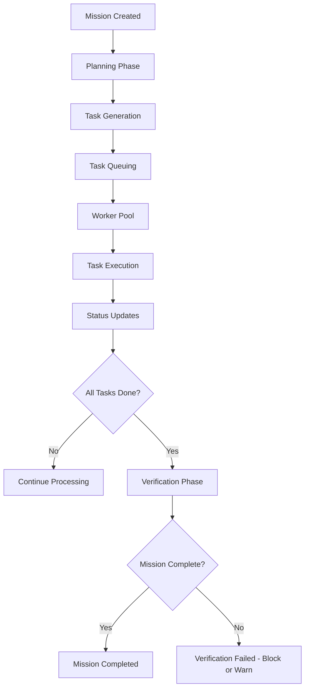
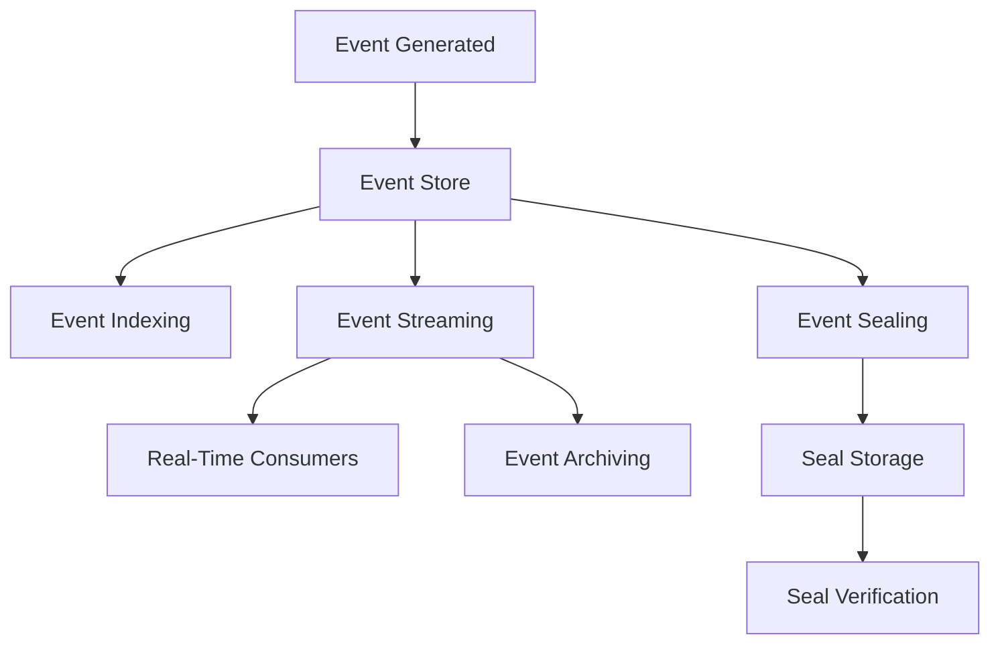
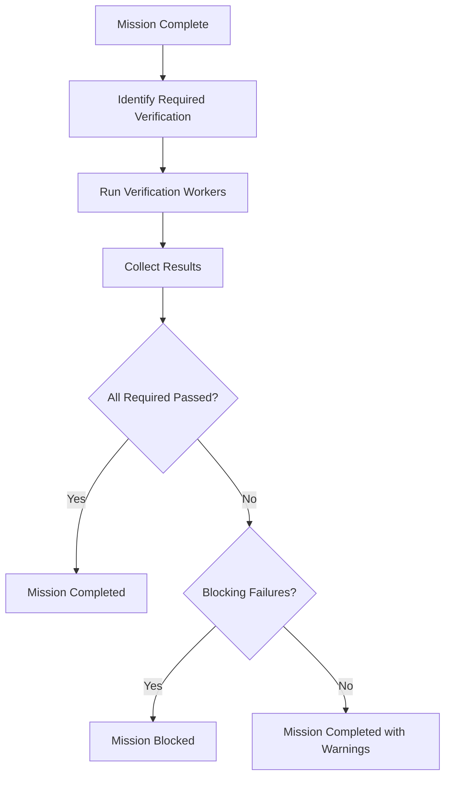

# AgentSwarm Performance Optimization: Maximizing Efficiency and Throughput

## TL;DR: Optimize AgentSwarm performance through strategic profiling, caching, database optimization, concurrent processing, and resource management to achieve maximum throughput, lowest latency, and efficient resource utilization.

## Quick Facts

- **Performance Pillars**: CPU optimization, memory management, I/O optimization, network optimization, database optimization
- **Key Metrics**: Response time (p50, p95, p99), throughput (requests/second), resource utilization (CPU%, memory%, disk I/O, network), error rates, queue depths
- **Optimization Strategies**: Profiling, benchmarking, load testing, caching, connection pooling, asynchronous processing, batching, compression
- **Monitoring Tools**: Prometheus, Grafana, Loki, Jaeger, Chrome DevTools, clinic.js, benchmark.js
- **Related Pillars**: [001-introduction.md](./001-introduction.md), [002-architecture.md](./002-architecture.md), [003-use-cases.md](./003-use-cases.md), [004-model-routing.md](./004-model-routing.md), [005-event-ledger.md](./005-event-ledger.md), [006-verification-gates.md](./006-verification-gates.md), [007-deployment-guide.md](./007-deployment-guide.md), [008-security-best-practices.md](./008-security-best-practices.md)

## Performance Philosophy

Performance optimization in AgentSwarm follows a systematic approach:

```
Measure → Analyze → Optimize → Validate → Repeat
```

### Key Principles
1. **Measure First**: Never optimize without baseline measurements
2. **Focus on Bottlenecks**: Optimize where it matters most (80/20 rule)
3. **Consider Trade-offs**: Performance vs. readability, development speed, maintainability
- **Optimize the Critical Path**: Focus on what users actually experience
- **Consider the Whole System**: Local optimizations can hurt global performance
- **Validate Changes**: Ensure optimizations don't break functionality or introduce regressions
- **Consider Cost**: Optimize for cost-effectiveness, not just raw speed
- **Plan for Scalability**: Optimize not just for current load but future growth

## Performance Metrics and Baselines

### Key Performance Indicators (KPIs)
| Metric | Description | Target (Example) | Measurement Tool |
|--------|-------------|------------------|------------------|
| **API Response Time (p50)** | Median response time for API requests | < 200ms | Prometheus + Histogram |
| **API Response Time (p95)** | 95th percentile response time | < 500ms | Prometheus + Histogram |
| **API Response Time (p99)** | 99th percentile response time | < 1000ms | Prometheus + Histogram |
| **Throughput** | Requests per second sustained | 1000+ req/s | Load testing (k6, Locust) |
| **Error Rate** | Percentage of failed requests | < 0.1% | Prometheus + Counter |
| **CPU Utilization** | Average CPU usage across instances | 40-60% (allows headroom) | node-exporter, CloudWatch |
| **Memory Utilization** | Average memory usage across instances | 50-70% (allows for GC and spikes) | node-exporter, CloudWatch |
| **Mission Throughput** | Missions completed per hour | Varies by complexity | Custom metrics |
| **Average Mission Duration** | Average time from mission creation to completion | Varies by complexity | Custom metrics |
| **Worker Utilization** | Percentage of time workers spend on productive work | 70-85% | Custom metrics |
| **Queue Depth** | Average number of tasks waiting in queue | < 10 tasks per worker | Redis or database metrics |
| **Cache Hit Ratio** | Percentage of requests served from cache | > 80% for read-heavy workloads | Redis stats, application metrics |
| **Database Query Time (p95)** | 95th percentile database query time | < 50ms | pg_stat_statements, EXPLAIN ANALYZE |
| **Connection Pool Usage** | Percentage of database connections in use | < 80% (allows for spikes) | pg_stat_activity |

### Establishing Baselines
Before optimizing, establish performance baselines:

#### 1. Load Testing Baseline
```bash
# Using k6 for load testing
k6 run --vus 100 --duration 5m script.js

# script.js example
import http from 'k6/http';
import { check, sleep } from 'k6';

export const options = {
  thresholds: {
    http_req_duration: ['p(95)<500'], // 95% of requests < 500ms
    http_req_failed: ['rate<0.01'],   // <1% failed requests
  },
};

export default function () {
  const res = http.get('https://api.example.com/health');
  check(res, {
    'status is 200': (r) => r.status === 200,
  });
  sleep(1);
}
```

#### 2. Application Profiling Baseline
```bash
# Using clinic.js for Node.js profiling
clinic doctor -- node server.js
# Then generate load with: autocannon -c 100 -d 30s http://localhost:8787/health
```

#### 3. Database Profiling Baseline
```sql
-- Enable pg_stat_statements if not already enabled
CREATE EXTENSION IF NOT EXISTS pg_stat_statements;

-- Reset statistics to establish clean baseline
SELECT pg_stat_statements_reset();

-- After workload, analyze slowest queries
SELECT 
  query,
  calls,
  total_time,
  mean_time,
  rows
FROM pg_stat_statements
WHERE dbid = (SELECT oid FROM pg_database WHERE datname = current_database())
ORDER BY mean_time DESC
LIMIT 20;
```

#### 4. Resource Utilization Baseline
```bash
# Using Docker stats
docker stats $(docker ps -q)

# Using Kubernetes
kubectl top pods
kubectl top nodes

# Using cloud provider metrics
# AWS CloudWatch, Azure Monitor, Google Cloud Monitoring
```

## CPU Optimization

### JavaScript/Node.js Specific Optimizations
#### 1. Event Loop Optimization
- **Avoid Synchronous Operations**: Never block the event loop with long-running operations
- **Use Worker Threads**: Offload CPU-intensive tasks to worker threads
- **Batch Operations**: Process multiple items in a single batch when possible
- **Use Async/Await Properly**: Don't mix callbacks and promises unnecessarily
- **Limit Event Listeners**: Remove listeners when no longer needed
- **Use Efficient Data Structures**: Choose appropriate data structures for the task

```javascript
// ❌ Bad: Blocking the event loop
function processData(data) {
  let result = '';
  for (let i = 0; i < data.length; i++) {
    result += processItem(data[i]); // Synchronous operation
  }
  return result;
}

// ✅ Good: Using worker threads for CPU-intensive work
const { Worker } = require('worker_threads');

function processDataAsync(data) {
  return new Promise((resolve, reject) => {
    const worker = new Worker('./worker.js', {
      workerData: data
    });
    
    worker.on('message', resolve);
    worker.on('error', reject);
    worker.on('exit', (code) => {
      if (code !== 0) 
        reject(new Error(`Worker stopped with exit code ${code}`));
    });
  });
}
```

#### 2. Garbage Collection Optimization
- **Minimize Object Creation**: Reuse objects when possible (object pools)
- **Use Primitive Types**: Prefer numbers and strings over objects when possible
- **Avoid Closures When Unnecessary**: Closures can prevent garbage collection
- **Use Weak References**: For caches and mappings that shouldn't prevent GC
- **Monitor GC Patterns**: Watch for frequent full GCs indicating memory issues
- **Tune GC Settings**: Only when necessary (Node.js has good defaults)

```javascript
// ❌ Bad: Creating unnecessary objects
function processItems(items) {
  const results = [];
  for (const item of items) {
    results.push(new ProcessedItem(item)); // Creates new object for each item
  }
  return results;
}

// ✅ Good: Reusing arrays when possible
function processItems(items) {
  const results = new Array(items.length);
  for (let i = 0; i < items.length; i++) {
    results[i] = new ProcessedItem(items[i]);
  }
  return results;
}
```

#### 3. Efficient Algorithms and Data Structures
- **Choose Appropriate Complexity**: O(1) > O(log n) > O(n) > O(n log n) > O(n^2)
- **Use Built-In Methods**: Array.map, filter, reduce are often optimized
- **Consider Lookup Tables**: Replace O(n) searches with O(1) hash lookups
- **Use Sets for Uniqueness**: O(1) add/check vs O(n) for arrays
- **Consider Binary Search**: For sorted arrays, O(log n) search
- **Benchmark Alternatives**: Don't assume - measure actual performance

```javascript
// ❌ Bad: O(n^2) nested loops for finding duplicates
function findDuplicates(arr) {
  const duplicates = [];
  for (let i = 0; i < arr.length; i++) {
    for (let j = i + 1; j < arr.length; j++) {
      if (arr[i] === arr[j]) {
        duplicates.push(arr[i]);
      }
    }
  }
  return duplicates;
}

// ✅ Good: O(n) using Set for tracking seen items
function findDuplicates(arr) {
  const seen = new Set();
  const duplicates = new Set();
  
  for (const item of arr) {
    if (seen.has(item)) {
      duplicates.add(item);
    } else {
      seen.add(item);
    }
  }
  
  return Array.from(duplicates);
}
```

### CPU Profiling Techniques
#### 1. Using Clinic.js
```bash
# Install clinic.js globally
npm install -g clinic

# Run with clinic doctor
clinic doctor -- node server.js
# Generate load in another terminal:
# autocannon -c 100 -d 30s http://localhost:8787/health

# View results in browser
```

#### 2. Using Node.js Built-in Profiler
```bash
# Run with profiler
node --prof server.js
# Generate load
# Process output
node --prof-process isolate-*.log > processed.txt
```

#### 3. Using Chrome DevTools
```bash
# Start Node.js with inspector
node --inspect-brk server.js
# Open chrome://inspect in Chrome
# Click "Open dedicated DevTools for Node"
# Profile CPU usage while applying load
```

#### 4. Using Flame Graphs
```bash
# Install flamegraph tools
git clone https://github.com/brendangregg/FlameGraph
cd FlameGraph
# Use with perf or dtrace (Linux/macOS) or ETW (Windows)
```

## Memory Optimization

### Memory Usage Patterns to Watch
- **Memory Leaks**: Gradually increasing memory usage over time
- **Memory Spikes**: Sudden increases in memory usage
- **Inefficient Data Structures**: Using more memory than necessary
- **Object Retention**: Unintentionally keeping references to objects
- **Buffer Bloat**: Accumulating large buffers without releasing them
- **Cache Overgrowth**: Caches growing beyond intended size

### Memory Optimization Techniques
#### 1. Efficient Data Structures
- **Use Typed Arrays**: For binary data (Uint8Array, Float32Array, etc.)
- **Use Maps and Sets Appropriately**: When you need key-value or unique value storage
- **Consider Arrays for Sequential Data**: More memory-efficient than objects for sequential integer keys
- **Use Bit Arrays**: For boolean flags when space is critical
- **Use String Interning**: For repeated strings (when beneficial)

```javascript
// ❌ Bad: Using object for numeric index lookup
const lookup = {};
for (let i = 0; i < 10000; i++) {
  lookup[i] = i * 2;
}

// ✅ Good: Using array for sequential integer keys
const lookup = new Array(10000);
for (let i = 0; i < 10000; i++) {
  lookup[i] = i * 2;
}
```

#### 2. Object Pooling
- **Reuse Expensive Objects**: For objects that are expensive to create
- **Manage Pool Size**: Prevent unbounded growth
- **Handle Object Reset**: Properly reset objects between uses
- **Consider Thread Safety**: If used from multiple threads
- **Monitor Pool Statistics**: Track hit/miss rates and adjust size

```javascript
class ObjectPool {
  constructor(createFn, resetFn, maxSize = 100) {
    this.createFn = createFn;
    this.resetFn = resetFn;
    this.maxSize = maxSize;
    this.pool = [];
    this.inUse = new Set();
  }
  
  acquire() {
    if (this.pool.length > 0) {
      const obj = this.pool.pop();
      this.resetFn(obj);
      this.inUse.add(obj);
      return obj;
    } else {
      const obj = this.createFn();
      this.inUse.add(obj);
      return obj;
    }
  }
  
  release(obj) {
    if (this.inUse.has(obj)) {
      this.inUse.delete(obj);
      if (this.pool.length < this.maxSize) {
        this.pool.push(obj);
      }
      // Object will be garbage collected if not pooled
    }
  }
  
  size() {
    return this.pool.length + this.inUse.size();
  }
  
  available() {
    return this.pool.length;
  }
  
  inUseCount() {
    return this.inUse.size();
  }
}
```

#### 3. Memory-Efficient Algorithms
- **Process in Chunks**: For large datasets, process in manageable chunks
- **Use Generators**: For lazy evaluation when possible
- **Stream Processing**: Process data as it arrives rather than loading everything
- **Return Iterators**: Instead of arrays when consumers can process incrementally
- **Use Slices and Views**: Instead of copying data when possible
- **Consider Immutable Data Structures**: When they prevent defensive copying

```javascript
// ❌ Bad: Loading entire file into memory
function processLargeFile(filename) {
  const data = fs.readFileSync(filename, 'utf8');
  // Process data...
  return result;
}

// ✅ Good: Streaming processing
function* processLargeFile(filename) {
  const stream = fs.createReadStream(filename, { encoding: 'utf8' });
  const rl = readline.createInterface({ input: stream });
  
  for await (const line of rl) {
    // Process line and yield result
    yield processLine(line);
  }
  
  rl.close();
}

// Even better: Use transform streams
function createProcessingStream() {
  return new Transform({
    transform(chunk, encoding, callback) {
      // Process chunk and push result
      this.push(processChunk(chunk));
      callback();
    }
  });
}
```

#### 4. Garbage Collection Optimization (continued)
- **Generation Hypothesis**: Most objects die young - optimize for short-lived objects
- **Tenuring Threshold**: Adjust how quickly objects move to older generation (when necessary)
- **Heap Size**: Set appropriate min and max heap sizes
- **GC Algorithm Selection**: Choose appropriate GC algorithm for workload type
- **Allocation Profiling**: Track where objects are being allocated

```bash
# Node.js memory profiling
node --mem-serializer --mem-relaxed server.js
# Process output with appropriate tools
```

### Memory Profiling Techniques
#### 1. Using Clinic.js
```bash
clinic flame -- node server.js
# Generate load, then view flame graph in browser
```

#### 2. Using Node.js Inspector
```bash
node --inspect server.js
# Use Chrome DevTools Memory panel to take heap snapshots
# Compare snapshots to find leaking objects
```

#### 3. Using heapdump
```javascript
const heapdump = require('heapdump');

// Trigger heap dump manually or on SIGUSR2
process.on('SIGUSR2', () => {
  heapdump.writeSnapshot(`/tmp/heap-${Date.now()}.heapsnapshot`);
});
```

#### 4. Using memwatch-next
```javascript
const memwatch = require('memwatch-next');

let hd; // Handle for heap diff
memwatch.on('leak', (info) => {
  console.error('Memory leak detected:', info);
  
  // Trigger heap dump on leak detection
  heapdump.writeSnapshot(`/tmp/leak-${Date.now()}.heapsnapshot`);
});

memwatch.on('stats', (stats) => {
  console.log('Memory stats:', stats);
  // Alert on sudden increases in memory usage
});
```

## I/O and Network Optimization

### Disk I/O Optimization
#### 1. Buffering Strategies
- **Use Appropriate Buffer Sizes**: Match to workload and hardware characteristics
- **Use Buffered I/O**: When available (fs.createReadStream, etc.)
- **Align I/O Operations**: To storage block boundaries when possible
- **Use Scatter/Gather I/O**: When supported (sendmsg, recvmmsg)
- **Consider Memory Mapping**: For frequently accessed read-only files (mmap)
- **Avoid Unnecessary Sync Operations**: Let OS handle buffering when possible

#### 2. File System Selection and Configuration
- **Choose Appropriate FS**: ext4, XFS, btrfs, ZFS based on workload
- **Mount Options**: 
  - noatime: Reduce writes from access time updates
  - nodiratime: Same for directories
  - data=writeback: For ext4 when data loss is acceptable on crash
  - barrier=0: For when you have other power loss protection
  - discard: For SSDs to enable TRIM
- **Journaling Mode**: Consider data=ordered vs data=writeback tradeoffs
- **Allocation Strategies**: Pre-allocate files when size is known in advance
- **Fragmentation Monitoring**: Monitor and defragment when necessary

#### 3. I/O Scheduling
- **Choose Appropriate Scheduler**: 
  - cfq: Fair queuing (good for mixed workloads)
  - deadline: Guarantees start time for requests
  - noop: Simple FIFO (good for SSDs)
  - bfq: Budget fair queuing (good for desktop responsiveness)
- **Tune Scheduler Parameters**: Based on workload characteristics
- **Consider None/Virtual**: For virtualized environments where host handles scheduling

#### 4. Caching Strategies
- **Page Cache**: Leverage OS page cache for frequently accessed files
- **Application Caching**: Cache file contents in application memory (when safe)
- **Buffered Writes**: Accumulate writes and flush periodically
- **Write-Back Caching**: Acknowledge writes before committing to disk
- **Read-Ahead**: Optimize read-ahead based on access patterns

```javascript
// ❌ Bad: Reading file synchronously in loop
function processFiles(filenames) {
  const results = [];
  for (const filename of filenames) {
    const data = fs.readFileSync(filename, 'utf8'); // Blocks thread
    results.push(processData(data));
  }
  return results;
}

// ✅ Good: Using streams and async/await
async function processFiles(filenames) {
  const results = [];
  for (const filename of filenames) {
    const data = await fs.promises.readFile(filename, 'utf8');
    results.push(processData(data));
  }
  return results;
}

// Even better: Process concurrently with limited concurrency
async processFilesConcurrently(filenames, maxConcurrent = 5) {
  const semaphore = new Semaphore(maxConcurrent);
  const promises = filenames.map(async (filename) => {
    await semaphore.acquire();
    try {
      const data = await fs.promises.readFile(filename, 'utf8');
      return processData(data);
    } finally {
      semaphore.release();
    }
  });
  
  return Promise.all(promises);
}
```

### Network Optimization
#### 1. Protocol Optimization
- **Use HTTP/2 or HTTP/3**: When possible for better multiplexing and header compression
- **Enable Keep-Alive**: Reuse TCP connections for multiple requests
- **Optimize TLS Handshakes**: Use session tickets, OCSP stapling, etc.
- **Consider QUIC**: For UDP-based applications when appropriate
- **Minimize Round Trips**: Combine related requests when possible
- **Use Binary Protocols**: When appropriate (Protocol Buffers, Avro, MessagePack)
- **Consider gRPC**: For service-to-service communication when appropriate

#### 2. Payload Optimization
- **Compress Responses**: Use gzip, brotli, or deflate for text-based responses
- **Minify JSON**: Remove unnecessary whitespace when bandwidth is critical
- **Use Binary JSON**: When appropriate (BSON, UBJSON, etc.)
- **Field Selection**: Allow clients to request only needed fields (GraphQL, sparse fieldsets)
- **Response Compression**: Only compress when beneficial (avoid compressing already compressed data)
- **Adaptive Compression**: Adjust compression level based on content type and CPU cost

#### 3. Connection Management
- **Connection Pooling**: Reuse connections rather than creating new ones
- **Proper Connection Closure**: Ensure connections are properly closed to prevent leaks
- **Connection Timeouts**: Set appropriate timeouts to prevent resource exhaustion
- **Keep-Alive Tuning**: Balance between connection reuse and resource consumption
- **Load Balancer Integration**: Ensure load balancers preserve connection semantics when needed
- **SSL Session Reuse**: Reuse SSL session parameters to avoid full handshake

#### 4. Transport Optimization
- **Choose Appropriate Transport**: TCP for reliability, UDP for speed when loss is acceptable
- **Optimize MTU**: To prevent fragmentation (path MTU discovery)
- **Consider TCP Congestion Control Algorithms**: 
  - cubic: Default in Linux, good for high-bandwidth, high-latency networks
  - bbr: Google's algorithm, often better for web traffic
  - reno: Classic algorithm
  - vegas: Focuses on minimizing delay and loss
- **Enable Explicit Congestion Notification (ECN)**: When network supports it
- **Adjust TCP Buffer Sizes**: Based on bandwidth-delay product
- **Consider TCP Fast Open**: When supported by clients and servers

#### 5. Application-Level Optimizations
- **Request Batching**: Combine multiple logical requests into one physical request
- **Response Streaming**: Stream large responses rather than buffering entirely
- **Conditional Requests**: Use ETag, Last-Modified, If-Modified-Since, etc.
- **Range Requests**: Allow clients to request only parts of large resources
- **Server Push**: HTTP/2 server push for known critical resources (use judiciously)
- **Client-Side Caching**: Leverage browser cache with appropriate cache-control headers
- **Service Workers**: For progressive web apps to enable offline functionality and efficient caching

### Specific Network Optimizations for AgentSwarm
#### 1. API Communication
- **Enable HTTP/2**: For better multiplexing of requests
- **Compress JSON Responses**: With gzip or brotli (typically 70-90% size reduction)
- **Implement ETag-Based Caching**: For infrequently changing data
- **Use CDN for Static Assets**: Offload API servers from serving static files
- **Optimize API Endpoints**: 
  - Combine related operations when possible
  - Use pagination for large list responses
  - Implement sparse fieldsets for partial responses
  - Use webhooks instead of polling when appropriate
- **Optimize Authentication**: 
  - Cache session validation results (with appropriate TTL)
  - Use JWT or similar for stateless authentication when appropriate
  - Consider API keys for service-to-service communication

#### 2. Worker Communication
- **Optimize Task Leasing**: 
  - Minimize database round trips for task leasing
  - Consider batch task leasing when appropriate
  - Use efficient locking mechanisms (FOR UPDATE SKIP LOCKED)
- **Minimize Status Updates**: 
  - Batch status updates when possible
  - Use efficient update patterns
  - Consider eventual consistency for non-critical status
- **Optimize Event Streaming**: 
  - Use efficient serialization (Protocol Buffers, MessagePack, etc.)
  - Consider binary protocols for high-volume event streams
  - Optimize heartbeat frequency
- **Leverage Multicast/Broadcast**: When appropriate for worker discovery (rarely used)

#### 3. Database Communication
- **Use Connection Pooling**: 
  - Size pools appropriately for workload
  - Monitor pool usage and adjust size as needed
  - Consider connection validation and eviction policies
- **Optimize Query Patterns**: 
  - Use INDEX scans when possible
  - Avoid SELECT * when only specific columns are needed
  - Use LIMIT and OFFSET appropriately (consider keyset pagination)
  - Avoid N+1 query problems
  - Use JOINs effectively when appropriate
- **Minimize Round Trips**: 
  - Batch related operations when possible
  - Use transactions for related operations that must be atomic
  - Consider stored procedures for complex server-side logic (when appropriate)
- **Optimize Data Transfer**: 
  - Fetch only needed columns
  - Use efficient data types (avoid TEXT when VARCHAR suffices)
  - Consider compression for large text fields (when beneficial)
  - Use binary formats for binary data (when applicable)

## Database Optimization

### Schema Optimization
#### 1. Indexing Strategy
- **Index Foreign Keys**: Always index foreign key columns for JOIN performance
- **Index Timestamp Columns**: For time-based queries and purging
- **Index Frequently Queried Columns**: Based on query patterns from pg_stat_statements
- **Consider Composite Indexes**: For queries that filter on multiple columns
- **Avoid Over-Indexing**: Each index slows down writes and increases storage
- **Use INDEX ONLY SCANS**: When possible (include all needed columns in index)
- **Consider Partial Indexes**: For queries that always filter on specific values
- **Use Expression Indexes**: For queries that use functions or expressions in WHERE clause
- **Monitor Index Usage**: Drop unused indexes periodically
- **Maintain Index Statistics**: Regularly ANALYZE tables

```sql
-- Good: Index foreign key and timestamp
CREATE INDEX idx_tasks_mission_id ON tasks(mission_id);
CREATE INDEX idx_tasks_created_at ON tasks(created_at);

-- Good: Composite index for common query pattern
CREATE INDEX idx_tasks_mission_status ON tasks(mission_id, status);

-- Good: Partial index for active tasks only
CREATE INDEX idx_tasks_active ON tasks(status) 
  WHERE status IN ('READY', 'LEASED', 'RUNNING');

-- Good: Include index for index-only scan
CREATE INDEX idx_events_mission_timestamp_payload 
  ON events(mission_id, timestamp) INCLUDE (payload);
```

#### 2. Data Type Optimization
- **Use Appropriate Numeric Types**: 
  - SMALLINT for small integers (-32768 to 32767)
  - INTEGER for regular integers (-2^31 to 2^31-1)
  - BIGINT for large integers (-2^63 to 2^63-1)
  - DECIMAL/NUMERIC for exact decimal values
  - REAL/DOUBLE PRECISION for approximate floating point
- **Use Appropriate String Types**: 
  - VARCHAR(n) for variable-length strings with known maximum
  - TEXT for arbitrarily long strings (when length truly unknown)
  - CHAR(n) for fixed-length strings (rarely used)
- **Use Appropriate Date/Time Types**: 
  - DATE for dates only
  - TIME for times only
  - TIMESTAMP for date and time (with or without time zone)
  - INTERVAL for time intervals
- **Use Appropriate Binary Types**: 
  - BYTEA for binary data
  - OID for large objects (consider alternatives like lo or external storage)
- **Consider ENUM Types**: For fixed sets of values (when values rarely change)
- **Consider JSONB**: For semi-structured data (when querying inside JSON is needed)
- **Avoid Overly Large Types**: Don't use BIGINT when INTEGER suffices
- **Use Appropriate Collations**: For proper sorting and comparison when needed

#### 3. Table Partitioning
- **Range Partitioning**: 
  - By time (most common for event logs, metrics)
  - By numeric ranges (customer ID, product ID, etc.)
- **List Partitioning**: 
  - By discrete values (region, department, status categories)
- **Hash Partitioning**: 
  - For even distribution when no natural partitioning key exists
- **Consider Declarative Partitioning**: PostgreSQL 10+ built-in partitioning
- **Use Partition Wisdom**: 
  - Each partition should contain enough data to be worthwhile
  - Avoid too many partitions (management overhead)
  - Consider query patterns when choosing partitioning key
  - Remember that global indexes and constraints have limitations
  - Plan for partition maintenance (adding new partitions, archiving old ones)

```sql
-- Example: Range partitioning by time for events
CREATE TABLE events (
  id UUID PRIMARY KEY DEFAULT gen_random_uuid(),
  mission_id UUID NOT NULL REFERENCES missions(id),
  task_id UUID REFERENCES tasks(id),
  type VARCHAR(100) NOT NULL,
  actor VARCHAR(255) NOT NULL,
  timestamp TIMESTAMPTZ NOT NULL,
  payload JSONB NOT NULL,
  -- Other columns...
) PARTITION BY RANGE (timestamp);

-- Create partitions for specific time ranges
CREATE TABLE events_2026_08 PARTITION OF events
  FOR VALUES FROM ('2026-08-01') TO ('2026-09-01');

CREATE TABLE events_2026_09 PARTITION OF events
  FOR VALUES FROM ('2026-09-01') TO ('2026-10-01');

-- And so on for future months
-- Consider automating partition creation
```

#### 4. Materialized Views
- **Use for Expensive Aggregations**: When same aggregation is queried frequently
- **Consider Refresh Strategy**: 
  - REFRESH CONCURRENTLY (allows concurrent access)
  - Schedule refreshes based on data volatility
  - Consider incremental refresh mechanisms
- **Store Useful Metadata**: 
  - When refreshed
  - How long refresh took
  - Any errors during refresh
- **Index Materialized Views**: Just like regular tables
- **Consider Alternatives**: 
  - Regular tables with trigger-based updates
  - Application-level caching
  - Query rewriting with automatic summary tables

```sql
-- Example: Materialized view for mission statistics
CREATE MATERIALIZED VIEW mission_stats AS
SELECT 
  m.id as mission_id,
  m.goal,
  m.status,
  m.created_at,
  m.started_at,
  m.completed_at,
  COUNT(e.id) as event_count,
  COUNT(t.id) as task_count,
  COUNT(CASE WHEN t.status = 'SUCCEEDED' THEN 1 END) as successful_tasks,
  COUNT(CASE WHEN t.status = 'FAILED' THEN 1 END) as failed_tasks,
  MAX(e.timestamp) as last_event_time
FROM missions m
LEFT JOIN events e ON m.id = e.mission_id
LEFT JOIN tasks t ON m.id = t.mission_id
GROUP BY m.id, m.goal, m.status, m.created_at, m.started_at, m.completed_at;

-- Create index for fast lookups
CREATE INDEX idx_mission_stats_mission_id ON mission_stats(mission_id);

-- Refresh concurrently (allows reads during refresh)
REFRESH MATERIALIZED VIEW CONCURRENTLY mission_stats;
```

### Query Optimization
#### 1. EXPLAIN and EXPLAIN ANALYZE
- **Use EXPLAIN**: To understand query plan without executing
- **Use EXPLAIN ANALYZE**: To see actual execution time and row counts
- **Look For**: 
  - Sequential scans on large tables (should usually be index scans)
  - Nested loops that should be hash joins or merge joins
  - Unplanned repartitioning or redistribution
  - Incorrect join order
  - Missing or incorrect index usage
  - Excessive sorting or hashing
  - Poor row count estimates leading to bad plan choices
- **Use VERBOSE**: For detailed information about plan nodes
- **Use BUFFERS**: To see buffer usage (shared, local, temp)
- **Use TIMING**: To see actual time spent in each node

```sql
-- Basic EXPLAIN
EXPLAIN
SELECT * 
FROM tasks 
WHERE mission_id = $1 
  AND status = 'READY';

-- EXPLAIN ANALYZE for actual timing
EXPLAIN ANALYZE
SELECT * 
FROM tasks 
WHERE mission_id = $1 
  AND status = 'REdy';

-- EXPLAIN with BUFFERS and TIMING
EXPLAIN (ANALYZE, BUFFERS, TIMING)
SELECT * 
FROM tasks 
WHERE mission_id = $1 
  AND status = 'READY';
```

#### 2. Common Optimization Techniques
- **Add Missing Indexes**: Based on EXPLAIN analysis showing seq scans
- **Rewrite Queries**: To enable better use of indexes
- **Avoid Functions on Indexed Columns**: 
  - WHERE UPPER(name) = 'JOHN' prevents index use on name column
  - Instead: WHERE name = 'JOHN' (with case-sensitive data) or 
  - CREATE INDEX ON tasks((UPPER(name))) for case-insensitive lookup
- **Use EXISTS Instead of COUNT**: When you only need to know if at least one exists
- **Use LIMIT 1**: When you only need one result
- **Optimize JOIN Order**: Let planner choose or use JOIN_CLAUSE collapse_limit
- **Consider Semijoins and Antijoins**: 
  - EXISTS/NOT EXISTS instead of IN/NOT IN for subqueries
  - Can be more efficient and handle NULLs better
- **Use APPLY (LATERAL)**: When you need to correlate subqueries with outer query
- **Consider Common Table Expressions (CTEs)**: 
  - For readability
  - For optimization (PostgreSQL 12+ can inline CTEs in many cases)
  - Be cautious with materialized CTEs (can be optimization barrier)
- **Watch for Implicit Conversions**: 
  - WHERE column = '123' when column is INTEGER forces cast on every row
  - Make sure types match exactly in comparisons
- **Use EXCLUDE Constraints**: For preventing overlapping time ranges (when applicable)
- **Consider BRIN Indexes**: For very large tables with naturally ordered data (time series)

#### 3. Specific Query Patterns in AgentSwarm
- **Mission Queries**: 
  - Almost always filtered by mission_id
  - Often filtered by status
  - Frequently joined with tasks and events
  - Example optimization: Composite index on (mission_id, status)
- **Task Queries**: 
  - Filtered by mission_id and status
  - Often ordered by created_at or timestamp
  - Frequently joined with missions and events
  - Example optimization: Composite index on (mission_id, status, created_at)
- **Event Queries**: 
  - Almost always filtered by mission_id
  - Frequently ordered by timestamp
  - Often filtered by type or actor
  - Example optimization: Composite index on (mission_id, timestamp, type)
  - Consider partitioning by timestamp range
- **Membership Queries**: 
  - Filtered by organization_id and user_id
  - Often joined with users and organizations
  - Example optimization: Composite index on (organization_id, user_id)
- **Approval Queries**: 
  - Filtered by mission_id and status
  - Often joined with tasks and missions
  - Example optimization: Composite index on (mission_id, status)

### Connection Pooling Optimization
#### 1. Pool Sizing
- **Formula**: 
  - Optimal pool size = (average connection usage time * requests per second) + safety margin
  - Or: Monitor pool usage and adjust based on percentiles (p95 usage)
- **Considerations**: 
  - Minimum pool size: Usually 1-5 connections to handle idle periods
  - Maximum pool size: Limited by database max_connections and available memory
  - Idle timeout: How long to keep idle connections open (balance resource usage vs reconnection cost)
  - Connection validation: How to verify connections are still good before reuse
- **Typical Values**: 
  - Web applications: 10-50 connections per instance
  - Background workers: 5-20 connections per instance
  - Batch processors: 1-5 connections per instance (often just 1)
- **Monitoring**: 
  - Track pool usage over time
  - Alert on sustained high usage (approaching max)
  - Watch for connection creation/destruction storms (indicates poor sizing)

#### 2. Pool Configuration Parameters
- **Idle Timeout**: 
  - Too short: Too many reconnections
  - Too long: Wasted resources on idle connections
  - Typical: 30 seconds to 5 minutes (depends on reconnection cost)
- **Connection Validation**: 
  - Never validate: Fastest but risks using broken connections
  - Validate on borrow: Good balance of safety and performance
  - Validate on return: Ensures returned connections are good
  - Validate periodically: Background validation of idle connections
  - Validation query: Should be cheap and fast (SELECT 1)
- **Fairness**: 
  - Fair: FIFO access to connections
  - Non-fair: May allow starvation but can have better throughput
- **Blocking vs Non-blocking**: 
  - Blocking: Wait for connection to become available
  - Non-blocking: Return error immediately if no connection available
- **Eviction Policies**: 
  - When pool exceeds max size, which connections to evict first?
  - Usually: Idle connections first, then least recently used

#### 3. Implementation Examples
- **Node.js (pg-pool)**: 
  ```javascript
  const { Pool } = require('pg');
  
  const pool = new Pool({
    connectionString: process.env.DATABASE_URL,
    max: 20,                  // Maximum connections in pool
    idleTimeoutMillis: 30000, // Close idle connections after 30 seconds
    connectionTimeoutMillis: 2000, // Wait 2 seconds for connection to become available
    // ... other options
  });
  ```
- **Java (HikariCP)**: 
  ```java
  HikariConfig config = new HikariConfig();
  config.setJdbcUrl(System.getProperty("DATABASE_URL"));
  config.setMaximumPoolSize(20);
  config.setIdleTimeout(30000); // 30 seconds
  config.setConnectionTimeout(2000); // 2 seconds
  config.setValidationTimeout(5000); // 5 seconds
  config.setLeakDetectionThreshold(60000); // 60 seconds
  
  HikariDataSource ds = new HikariDataSource(config);
  ```
- **Python (SQLAlchemy)**: 
  ```python
  from sqlalchemy import create_engine
  
  engine = create_engine(
      os.getenv("DATABASE_URL"),
      pool_size=20,
      max_overflow=10,
      pool_timeout=30,
      pool_recycle=1800,  # Recycle connections after 30 minutes
      pool_pre_ping=True  # Validate connections before use
  )
  ```

### Caching Strategies

#### 1. Application-Level Caching
- **In-Memory Caching**: 
  - Use when data is frequently accessed and expensive to compute
  - Consider size limits and eviction policies (LRU, LFU, FIFO)
  - Be careful with memory usage - don't let cache grow unbounded
  - Consider thread safety if accessed from multiple threads
  - Consider cache warming for predictable workloads
  - Consider cache invalidation strategies (time-based, event-based)
- **Examples**: 
  - LRU Cache (Least Recently Used)
  - LFU Cache (Least Frequently Used)
  - ARC Cache (Adaptive Replacement Cache)
  - Two Queue Algorithm (2Q)
- **Libraries**: 
  - Node.js: lru-cache, lru-lru, mnemonist
  - Python: functools.lru_cache, cachetools
  - Java: Caffeine, Guava Cache
- **Example (Node.js lru-cache)**:
  ```javascript
  const LRU = require('lru-cache');
  
  const optionsCache = new LRU({
    max: 500,           // Maximum number of items to store
    ttl: 1000 * 60 * 60, // Time to live: 1 hour
    dispose: (key, value) => {
      // Optional cleanup function
      console.log(`Disposing ${key}`);
    },
    stale: false,       // Don't return stale items
    maxSize: 1000 * 1000 // Maximum size in bytes (optional)
  });
  
  function getOptions(userId) {
    // Try cache first
    const cached = optionsCache.get(userId);
    if (cached !== undefined) {
      return cached;
    }
    
    // Not in cache - compute and store
    const result = computeExpensiveOptions(userId);
    optionsCache.set(userId, result);
    return result;
  }
  ```

#### 2. Distributed Caching (Redis/Memcached)
- **Use When**: 
  - Need to share cache across multiple instances
  - Dataset too large for individual instance memory
  - Require persistence or replication
  - Want to offload memory usage from application instances
- **Considerations**: 
  - Network latency (local cache is faster)
  - Serialization/deserialization overhead
  - Complexity of invalidation and consistency
  - Cost of additional service
  - Security (encryption, authentication, network isolation)
- **Data Types**: 
  - Strings: Simple key-value storage
  - Hashes: Field-value pairs within a key
  - Lists: Ordered collections
  - Sets: Unordered collections of unique strings
  - Sorted Sets: Collections with scores for sorting
  - Bitmaps: Bit arrays
  - HyperLogLogs: Approximate count distinct
  - Geospatial: Location-based data
  - Streams: Append-only logs similar to Kafka
- **Common Patterns**: 
  - Cache-Aside: Application checks cache, loads from DB on miss, stores on hit
  - Read-Through: Cache provider loads from DB on miss
  - Write-Through: Cache provider writes to DB on write
  - Write-Back: Cache provider writes asynchronously to DB
  - Refresh-Ahead: Proactively refresh cache before expiration
- **Eviction Policies**: 
  - LRU (Least Recently Used): Default for most Redis configurations
  - LFU (Least Frequently Used): Available in Redis 4.0+
  - Random: Random eviction
  - TTL: Time-based eviction
- **Serialization**: 
  - JSON: Human-readable, widely supported
  - MessagePack: Binary, more efficient than JSON
  - Protocol Buffers: Binary, schema-defined, highly efficient
  - CBOR: Binary, based on JSON but more efficient
  - Pickle: Python-specific (use with caution)
- **Examples in AgentSwarm**: 
  - Session storage (Redis-backed sessions)
  - Task queue (Redis lists for backpressure signals)
  - Pub/sub channels (Redis for event broadcasting)
  - Rate limiting counters (Redis INCR with EXPIRE)
  - Leaderboards (Redis sorted sets)
  - Temporary caches (Redis with EXPIRE)

#### 3. HTTP Caching
- **Cache-Control Header**: 
  - max-age: Seconds until response is considered stale
  - s-maxage: Same as max-age but for shared caches (CDNs, proxies)
  - public: Response can be cached by any cache
  - private: Response intended for single user, must not be stored by shared caches
  - no-cache: Must revalidate with origin server before use
  - no-store: Must not be stored anywhere (for sensitive data)
  - must-revalidate: Must revalidate once stale
  - proxy-revalidate: Same as must-revalidate but for proxies
- **ETag Header**: 
  - Opaque validator for conditional requests
  - Strong ETag: Changes whenever entity body changes
  - Weak ETag: Changes when entity body changes in significant way
- **Last-Modified Header**: 
  - Date when resource was last modified
  - Less precise than ETag but useful for range requests
- **Vary Header**: 
  - Specifies which request headers affect the response
  - Important for content negotiation, authentication, etc.
- **Implementing HTTP Caching in AgentSwarm**: 
  - Static assets: Aggressive caching (max-age=31536000, immutable)
  - API responses: 
    - Short-term caching for slowly changing data (max-age=60)
    - No caching for personalized or frequently changing data
    - ETag-based validation for moderately changing data
  - Consider using CDN for geographic distribution and edge caching

#### 4. Database Query Caching
- **When to Use**: 
  - Expensive, frequently repeated queries with unchanging results
  - Read-heavy workloads with tolerant freshness requirements
  - When database is the bottleneck
- **When to Avoid**: 
  - Frequently changing data
  - When consistency is critical
  - When query results depend on session state or transaction isolation
  - When query has side effects (shouldn't happen in SELECT, but be careful)
- **Implementation Options**: 
  - Application-level caching of query results
  - Database-specific query cache (MySQL has this, PostgreSQL does not by default)
  - Materialized views (discussed earlier)
  - Caching proxy (like pgbouncer with query caching, though rare)
- **Example Application-Level Query Caching**:
  ```javascript
  const queryCache = new LRU({
    max: 1000,
    ttl: 60 * 1000, // 1 minute
  });
  
  async getUserMissions(userId) {
    // Check cache first
    const cacheKey = `user-missions:${userId}`;
    const cached = queryCache.get(cacheKey);
    if (cached !== undefined) {
      return cached;
    }
    
    // Not in cache - execute query
    const result = await pool.query(
      `SELECT * FROM missions 
       WHERE organization_id = ANY(
         SELECT organization_id FROM memberships WHERE user_id = $1
       )`,
      [userId]
    );
    
    // Store in cache
    queryCache.set(cacheKey, result.rows);
    return result.rows;
  }
  ```

## Concurrent Processing and Async Patterns

### Concurrency Models in Node.js
- **Single-Threaded Event Loop**: Default Node.js model
- **Worker Threads**: For CPU-intensive tasks
- **Child Processes**: For isolating work or using multiple cores
- **Cluster Module**: For multi-core HTTP servers
- **Async/Await and Promises**: For managing asynchronous operations
- **Observables and Reactive Programming**: For complex event streams
- **Message Passing**: For communication between independent processes

### Optimizing Concurrency in AgentSwarm
#### 1. Worker Pool Optimization
- **Right-Sizing Worker Pool**: 
  - Based on task characteristics and system resources
  - Monitor queue depth, processing time, and worker utilization
  - Adjust based on workload patterns (diurnal, weekly patterns)
- **Specialized Worker Pools**: 
  - Different pools for different task types (CPU-bound vs I/O-bound)
  - Different pools for different priority levels
  - Different pools for different tenant types (if multi-tenant with SLAs)
- **Work Stealing**: 
  - Idle workers steal work from busy workers' queues
  - Helps balance load without central coordination
- **Backpressure Signaling**: 
  - Workers signal when they're overloaded
  - System adjusts task intake or scales resources accordingly
- **Health Checks**: 
  - Remove unhealthy workers from pool
  - Replace with healthy workers
- **Graceful Shutdown**: 
  - Stop accepting new work
  - Wait for current work to complete
  - Then shut down

#### 2. Task Queuing and Distribution
- **Queueing Theory Basics**: 
  - Little's Law: L = λW (average number in system = arrival rate × average time in system)
  - Aim for low queue depth and low wait time
  - Monitor utilization: ρ = λ/(cμ) where c=servers, μ=service rate
  - Target utilization: 70-85% for good response times with headroom for spikes
- **Queue Types**: 
  - FIFO (First In, First Out): Fair but can cause head-of-line blocking
  - Priority Queues: Higher priority tasks jump the queue
  - Delay Queues: Tasks become available after delay
  - Dead Letter Queues: For repeatedly failing tasks
  - Priority Delay Queues: Combination of priority and delay
- **Queue Implementation**: 
  - In-memory: Fast but not persistent
  - Persistent: Redis lists, RabbitMQ, Apache Kafka, Amazon SQS, etc.
  - Hybrid: In-memory for active set, persistent for overflow
- **Work Distribution Strategies**: 
  - Round Robin: Simple, fair distribution
  - Weighted Round Robin: Based on worker capacity
  - Least Connections: Send to worker with fewest active tasks
  - Least Response Time: Send to worker with fastest recent response
  - IP Hash: Based on source IP for session persistence
  - URL Hash: Based on request URL for caching efficiency
  - Least Time: Combines least connections and fastest response

#### 3. Async/Await Best Practices
- **Avoid Promise Anti-Patterns**: 
  - Don't forget to await (creates unresolved promises)
  - Don't mix callbacks and promises unnecessarily
  - Don't create promise chains that are harder to read than async/await
  - Don't ignore promise rejections (leads to unhandled rejections)
  - Don't create unnecessarily long promise chains (hard to debug)
- **Use Promise.all() Appropriately**: 
  - For independent operations that can run in parallel
  - Be aware that one rejection rejects the whole promise
  - Consider Promise.allSettled() when you want all results regardless of outcome
  - Consider Promise.race() when you only need the first to finish
- **Use Promise.race() Carefully**: 
  - For timeouts: Promise.race([promise, delayPromise])  
  - For fallback mechanisms: Promise.ray([primary, fallback])
  - Be aware that only the first settling promise matters
- **Use Async Iterators Appropriately**: 
  - For processing streams of data asynchronously
  - For async versions of map, filter, reduce
  - Be aware of backpressure and cancellation
- **Use Top-Level Await (ESM Modules)**: 
  - When the entire module depends on an async operation
  - Be aware that this blocks module loading until resolution

#### 4. Parallel Processing Patterns
- **Map-Reduce**: 
  - Map: Process items independently in parallel
  - Reduce: Combine results from map phase
  - Consider intermediate combining to reduce shuffle
- **Fork-Join**: 
  - Fork: Split work into parallel tasks
  - Join: Wait for all tasks to complete before proceeding
  - Consider work-stealing idle workers
- **Pipeline Processing**: 
  - Break work into stages
  - Each stage processes items and passes to next stage
  - Consider buffer sizes between stages
  - Monitor for bottlenecks in specific stages
- **Divide and Conquer**: 
  - Split problem into subproblems
  - Solve subproblems recursively
  - Combine solutions from subproblems
  - Effective for sorting (merge sort, quick search) and searching (binary search)
- **Geographic Distribution**: 
  - Process data where it resides to minimize transfer
  - Consider edge computing for geographic distribution
  - Account for data transfer costs in decision making

### Specific Concurrency Optimizations in AgentSwarm
#### 1. Mission Processing Pipeline


#### Optimizations:
- **Parallel Task Execution**: Multiple workers process tasks concurrently
- **Async Status Updates**: Batch status updates to reduce database load
- **Efficient Task Queuing**: Use efficient queue implementation (Redis lists, etc.)
- **Worker Specialization**: Assign tasks to workers based on capabilities when possible
- **Backpressure Handling**: Scale workers or pause task generation when overloaded

#### 2. Event Processing Pipeline


#### Optimizations:
- **Batch Event Inserts**: Use multi-row INSERT when possible
- **Async Index Updates**: Let database handle index updates automatically
- **Efficient Streaming**: Use binary protocols, compress when beneficial
- **Periodic Sealing**: Seal events periodically rather than after every event
- **Parallel Sealing**: Seal different missions in parallel
- **Asynchronous Archiving**: Archive events in background without blocking main flow

#### 3. Verification Processing Pipeline


#### Optimizations:
- **Parallel Verification**: Run different verification types in parallel
- **Worker Specialization**: Use workers optimized for specific verification types
- **Early Termination**: Stop verification early when blocking failure detected
- **Result Caching**: Cache verification results when safe (be careful with security-sensitive results)
- **Adaptive Verification**: Adjust verification strictness based on mission risk level

## Resource Utilization Optimization

### CPU Optimization (continued)
- **Affinity and Pinning**: 
  - Bind processes to specific CPU cores to reduce cache misses
  - Useful for performance-critical, latency-sensitive workloads
  - Less beneficial in virtualized or containerized environments
  - Can interfere with scheduler's ability to balance load
- **NUMA Awareness**: 
  - On NUMA systems, allocate memory close to the CPU using it
  - Important for large memory-intensive workloads
  - Less relevant for most cloud and container deployments
- **Instruction-Level Optimization**: 
  - Rely on compiler optimizations
  - Consider SIMD (Single Instruction, Multiple Data) when applicable
  - Profile-guided optimization (PGO) for hot code paths
  - Avoid pipeline stalls and branch mispredictions
- **Thread-Local Storage**: 
  - Reduce contention by giving each thread its own storage
  - Be careful about memory usage (multiplies by thread count)
  - Use for per-thread counters, buffers, state machines

### Memory Optimization (continued)
- **Memory Allocation Strategies**: 
  - Use memory pools for frequently allocated objects of same size
  - Use slab allocators for kernel objects
  - Use buddy allocators for page-level management
  - Consider buddy allocators for user-space allocations when appropriate
- **Garbage Collection Tuning**: 
  - Only adjust when measurements show benefit
  - Consider different GC algorithms (parallel, concurrent, G1, Z, Shenandoah)
  - Adjust heap size based on workload characteristics
  - Consider heap partitioning for large heaps
- **Memory Compression**: 
  - Some systems compress memory pages when under pressure
  - Transparent to applications but uses CPU
  - Consider if swap is better alternative
- **Memory Deduplication**: 
  - Identify and deduplicate identical memory pages
  - Most effective for virtualized environments with many similar VMs
  - Rarely beneficial for bare-metal or container workloads

### I/O Optimization (continued)
- **Read-Ahead Optimization**: 
  - Adjust filesystem read-ahead based on access patterns
  - Sequential reads benefit from large read-ahead
  - Random reads benefit from small or zero read-ahead
- **Write-Back Throttling**: 
  - Limit rate of dirty page flushing to prevent I/O spikes
  - Balance between data safety and write performance
- **I/O Scheduler Selection**: 
  - cfq: Good for general purpose workloads
  - deadline: Good for database workloads
  - noop: Good for SSDs and virtualized environments
  - bfq: Good for desktop workloads
  - none: Delegate to underlying hardware (NVMe, etc.)
- **NCQ (Native Command Queuing)**: 
  - Allows drive to reorder commands for optimal performance
  - Generally beneficial, leave enabled unless specific reason to disable
- **TRIM/Discard**: 
  - Inform SSD which blocks are no longer needed
  - Prevents performance degradation over time
  - Usually enabled by default in modern systems

### Network Optimization (continued)
- **TCP Buffer Sizing**: 
  - Base on bandwidth-delay product (BWD = bandwidth × round-trip time)
  - Typical values: 
    - Receive buffer: 256KB-4MB
    - Send buffer: 256KB-4MB
  - Adjust based on measured performance
  - Consider automatic tuning (tcp_moderate_rcvbuf, etc.)
- **TCP Congestion Control**: 
  - Reno: Classic, loss-based
  - Cubic: Default in Linux, good for high-BDP networks
  - BBR: Google's model-based, often better for web traffic
  - Vegas: Delay-based, good for low-loss networks
  - Hybla: Designed for high-latency, high-loss networks (satellite)
- **TCP Queue Length**: 
  - Balance between handling bursts and bufferbloat
  - Typical: 1000 packets (adjust based on bandwidth and latency)
- **UDP Buffer Sizing**: 
  - Receive buffer: Important for preventing packet loss
  - Send buffer: Usually less critical
- **Network Interface Offloading**: 
  - Checksum offloading: Compute checksums in hardware
  - Segmentation offloading: Large send/receive offload (LSO/LRO)
  - Receive side scaling (RSS): Distribute processing across multiple cores
  - Receive packet steering (RPS): Similar to RSS but software-based
  - Receive flow steering (RFS): Accelerate packet forwarding
- **Interrupt Moderation**: 
  - Reduce interrupt rate by processing multiple packets per interrupt
  - Balance between latency and throughput
  - Too high: Increased latency
  - Too low: Decreased throughput under load

## Performance Testing and Validation

### Types of Performance Tests
#### 1. Load Testing
- **Purpose**: Determine how system behaves under expected load
- **Types**: 
  - Normal load: Expected peak load
  - Stress load: Beyond expected capacity to find breaking point
  - Spike load: Sudden increases in load
  - Soak test: Extended period at moderate load to find memory leaks
- **Tools**: k6, Locust, Gatling, JMeter, Artillery, wrk, hey
- **Metrics**: Response times, throughput, error rates, resource utilization

#### 2. Stress Testing
- **Purpose**: Find breaking point and observe failure modes
- **Approach**: 
  - Gradually increase load until system breaks
  - Observe how system fails (gracefully or catastrophically)
  - Observe recovery behavior
  - Identify bottlenecks under extreme load
- **Metrics**: Same as load testing plus failure mode analysis

#### 3. Spike Testing
- **Purpose**: Determine ability to handle sudden load increases
- **Approach**: 
  - Apply normal load
  - Suddenly increase to very high level
  - Then drop back to normal level
  - Observe handling of increase and decrease
- **Metrics**: Response time during spike, recovery time, error rates during transitions

#### 4. Soak Testing (Endurance Testing)
- **Purpose**: Find memory leaks and resource leaks over time
- **Approach**: 
  - Apply moderate load for extended period (hours to days)
  - Monitor for gradual degradation in performance
  - Monitor for memory leaks, file descriptor leaks, etc.
  - Monitor for performance degradation over time
- **Metrics**: Memory usage over time, file descriptor count, handle counts, etc.

#### 5. Configuration Testing
- **Purpose**: Determine optimal configuration settings
- **Approach**: 
  - Test different values for a parameter while holding others constant
  - Identify value that gives best performance
  - Consider interaction effects between parameters
- **Approaches**: 
  - One-factor-at-a-time (OFAT): Simple but misses interactions
  - Factorial design: Tests combinations of factors
  - Response surface methodology: For optimization
  - Taguchi methods: For robust design
- **Tools**: Design of Experiments (DoE) software, custom scripts

#### 6. Component Testing
- **Purpose**: Test individual components in isolation
- **Approach**: 
  - Isolate component from system
  - Provide simulated inputs
  - Measure component performance
  - Identify component-level bottlenecks
- **Benefits**: 
  - Easier to isolate variables
  - Can test extreme conditions safely
  - Faster feedback loop
  - Enables more detailed profiling

#### 7. Network Testing
- **Purpose**: Test network characteristics and performance
- **Approach**: 
  - Measure latency, jitter, packet loss
  - Test throughput under various conditions
  - Test with various packet sizes
  - Test with various concurrent connection counts
- **Tools**: ping, traceroute, iperf3, netperf, hping3, tcptrace
- **Considerations**: 
  - Controlled environment to isolate variables
  - Consider both LAN and WAN characteristics
  - Test both directions (asymmetric links possible)
  - Test under various loads

### Performance Testing Methodology
#### 1. Define Clear Objectives
- **What are you trying to achieve?**: 
  - Improve response time? 
  - Increase throughput? 
  - Reduce resource usage? 
  - Improve scalability?
- **What are your success criteria?**: 
  - Specific numeric targets 
  - Comparative improvements 
  - Meeting SLAs or SLOs
- **What is your scope?**: 
  - Which components or services? 
  - Which user journeys or transactions? 
  - Which performance dimensions?

#### 2. Establish Baselines
- **Measure Current Performance**: 
  - Under typical load conditions
  - Under peak load conditions
  - Under stress conditions (if applicable)
- **Document Measurement Methods**: 
  - Ensure reproducibility 
  - Include warm-up and cool-down periods
  - Use appropriate measurement intervals
- **Record Environmental Factors**: 
  - Hardware specifications 
  - Software versions 
  - Network conditions 
  - Background load

#### 3. Isolate Variables
- **Change One Thing at a Time**: 
  - For initial exploration and hypothesis testing
- **Use Controlled Experiments**: 
  - For precise measurement of effects
  - Account for confounding variables
- **Use Blinded Testing When Possible**: 
  - To avoid observer bias
- **Use Replication**: 
  - Run multiple times to account for variability
  - Use statistical analysis to determine significance

#### 4. Measure Accurately
- **Use Appropriate Tools**: 
  - Match tool to what you're measuring
  - Ensure tools don't significantly affect what they're measuring
- **Warm Up Systems**: 
  - Allow caches to fill, JIT to optimize, etc.
  - Typically 5-15 minutes of load before measurement
- **Cool Down Properly**: 
  - Allow systems to return to baseline between tests
  - Prevent carryover effects from previous tests
- **Measure at Multiple Points**: 
  - Entry and exit of system
  - Key internal points for bottleneck identification
  - Client-side and server-side measurements
- **Account for Measurement Overhead**: 
  - Subtract known measurement overhead when possible
  - Use passive monitoring when possible
  - Recognize that all measurement affects the system to some degree

#### 5. Analyze Results
- **Look for Patterns**: 
  - Trends over time 
  - Correlations between metrics 
  - Cause-effect relationships 
  - Outliers and anomalies
- **Use Statistical Methods**: 
  - Descriptive statistics (mean, median, mode, percentiles, std dev)
  - Inferential statistics (confidence intervals, hypothesis testing)
  - Time series analysis (if applicable)
  - Regression analysis (to understand relationships)
- **Consider Practical Significance**: 
  - Is a statistically significant difference practically meaningful?
  - Consider effect size, not just p-value
- **Compare to Baselines and Targets**: 
  - How much did we improve? 
  - Did we meet our targets? 
  - What remains to be improved?

#### 6. Document and Communicate
- **Record Test Conditions**: 
  - Hardware, software, network, load parameters
  - Pre-test and post-test conditions
  - Any anomalies or deviations from plan
- **Document Procedures**: 
  - Enough detail for others to reproduce
  - Include warm-up, measurement, and cool-down periods
  - Include any special setup or teardown procedures
- **Present Results Clearly**: 
  - Use appropriate visualizations (line graphs, bar charts, scatter plots, heatmaps)
  - Use appropriate statistical summaries
  - Highlight key findings and their implications
  - Compare to objectives and success criteria
- **Discuss Limitations**: 
  - What the test does and does not tell you
  - Sources of uncertainty and error
  - Assumptions made and their validity
- **Recommend Next Steps**: 
  - What to try next based on results
  - What to investigate further
  - What to implement or discard
  - How to validate findings in production

### Specific Performance Testing for AgentSwarm
#### 1. API Endpoint Testing
```bash
# Using k6 for API load testing
import http from 'k6/http';
import { check, sleep } from 'k6';
import { Counter, Gauge, Rate } from 'k6/metrics';

export const errorRate = new Rate('errors');
export const requestRate = new Rate('requests', true);
export const responseTime = new Gauge('http_req_duration');

export const options = {
  stages: [
    { duration: '2m', target: 20 }, // Ramp up to 20 VUs
    { duration: '5m', target: 20 }, // Stay at 20 VUs for 5 minutes
    { duration: '2m', target: 0 },  // Ramp down to 0 VUs
  ],
  thresholds: {
    'http_req_duration': ['p(95)<500'], // 95% of requests < 500ms
    'errors': ['rate<0.01'],            // <1% error rate
    'http_req_failed': ['rate<0.01'],   // <1% failed requests
  },
};

export default function () {
  const res = http.get('https://api.example.com/health');
  const success = check(res, {
    'status is 200': (r) => r.status === 200,
  });
  
  errorRate.add(!success);
  requestRate.add(1);
  responseTime.add(res.timings.duration);
  
  sleep(1);
}
```

#### 2. Database Query Performance Testing
```sql
-- Reset statistics for clean baseline
SELECT pg_stat_statements_reset();

-- Run your test workload here
-- (In another terminal, run your load test)

-- Analyze results
SELECT 
  query,
  calls,
  total_time,
  mean_time,
  stddev_time,
  rows,
  100.0 * shared_blks_hit / NULLIF(shared_blks_hit + shared_blks_read, 0) AS hit_ratio
FROM pg_stat_statements
WHERE dbid = (SELECT oid FROM pg_database WHERE datname = current_database())
  AND calls > 100  -- Only look at queries called significant number of times
ORDER BY mean_time DESC
LIMIT 20;
```

#### 3. End-to-End Mission Performance Testing
```javascript
// Using custom script to measure mission throughput
import { Client } from 'pg';
import { v4 as uuidv4 } from 'uuid';

async function runMissionPerformanceTest(durationSeconds = 60, concurrentMissions = 10) {
  const client = new Client({ connectionString: process.env.DATABASE_URL });
  await client.connect();
  
  const startTime = Date.now();
  const endTime = startTime + (durationSeconds * 1000);
  
  let missionsStarted = 0;
  let missionsCompleted = 0;
  const missionDurations = [];
  
  // Start missions at steady rate
  const interval = setInterval(async () => {
    if (Date.now() >= endTime) {
      clearInterval(interval);
      return;
    }
    
    const missionId = uuidv4();
    const goal = `Performance test mission ${missionsStarted}`;
    
    try {
      await client.query(
        `INSERT INTO missions (id, goal, mode, status, organization_id, project_id, created_by)
         VALUES ($1, $2, 'SWARM', 'QUEUED', $3, $4, $5)`,
        [missionId, goal, 'org-123', 'proj-456', 'user-789']
      );
      
      missionsStarted++;
      
      // In real system, worker would pick this up and process it
      // For test, we'll simulate completion after random delay
      setTimeout(async () => {
        await client.query(
          `UPDATE missions 
           SET status = 'COMPLETED', 
               completed_at = NOW() 
           WHERE id = $1`,
          [missionId]
        );
        
        missionsCompleted++;
        const duration = Date.now() - Date.parse(missionCreatedAt); // Would need to store creation time
        missionDurations.push(duration);
      }, Math.random() * 3000 + 2000); // Random delay between 2-5 seconds
      
    } catch (err) {
      console.error('Error starting mission:', err);
    }
  }, 1000 / (concurrentMissions / 5)); // Adjust rate to achieve desired concurrency
  
  // Wait for test duration
  await new Promise(resolve => setTimeout(resolve, durationSeconds * 1000));
  
  // Wait for any remaining missions to complete
  await new Promise(resolve => setTimeout(resolve, 5000)); // Give 5 seconds for completion
  
  await client.end();
  
  // Calculate metrics
  const actualDuration = (Date.now() - startTime) / 1000;
  const missionThroughput = missionsCompleted / actualDuration;
  const avgMissionDuration = missionDurations.reduce((a, b) => a + b, 0) / missionDurations.length;
  
  return {
    durationSeconds: actualDuration,
    missionsStarted,
    missionsCompleted,
    missionThroughput: missionThroughput.toFixed(2),
    avgMissionDurationMs: avgMissionDuration.toFixed(0),
  };
}

// Run the test
runMissionPerformanceTest(30, 5) // 30 seconds, target ~5 concurrent missions
  .then(results => console.log(JSON.stringify(results, null, 2)))
  .catch(console.error);
```

## Conclusion

Performance optimization is an ongoing journey, not a destination. By systematically measuring, analyzing, optimizing, and validating, you can continually improve AgentSwarm's performance to meet your evolving needs.

Remember that:
1. **Premature optimization is the root of all evil** - Optimize only when measurements show a benefit
2. **Context matters** - What works for one workload may not work for another
3. **Trade-offs are inevitable** - Performance often trades off against development speed, maintainability, or resource usage
4. **Systems are interconnected** - Optimizing one part can hurt another part
5. **The goal is user satisfaction** - Optimize for what users actually experience, not just benchmarks
6. **Continuous improvement is key** - Regularly re-measure and re-optimize as workloads and technology change

By following the principles and techniques outlined in this guide, you can optimize AgentSwarm to deliver the best possible performance for your specific use case, whether you're handling a few missions per day or thousands per hour.

Ready to optimize? Start with profiling your current deployment to identify bottlenecks, then systematically work through the optimization strategies outlined in this guide.

## Related Resources
- [001-introduction.md](./001-introduction.md): What is AgentSwarm?
- [002-architecture.md](./002-architecture.md): Technical deep dive
- [003-use-cases.md](./003-use-cases.md): Real-world applications
- [004-model-routing.md](./004-model-routing.md): How we select AI providers
- [005-event-ledger.md](./005-event-ledger.md): Our tamper-evident event sourcing system
- [006-verification-gates.md](./006-verification-gates.md): Independent validation of AI work
- [007-deployment-guide.md](./007-deployment-guide.md): Deployment considerations affecting performance
- [008-security-best-practices.md]:008-security-best-practices.md): Security considerations that affect performance
- [DEPLOY.md](../DEPLOY.md): Original deployment instructions